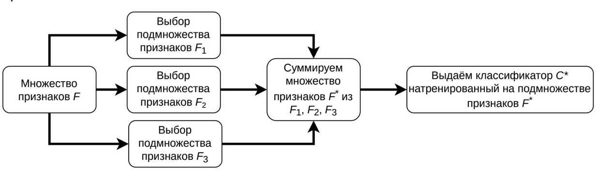
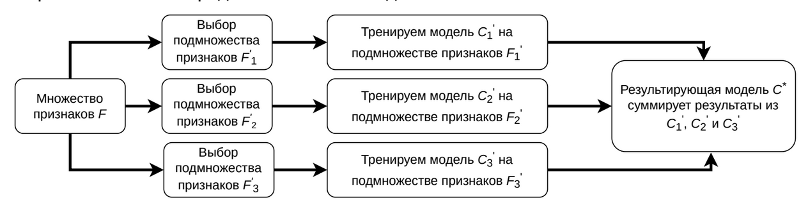
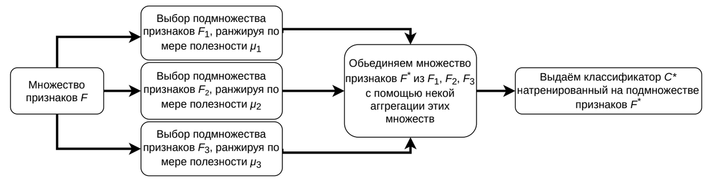
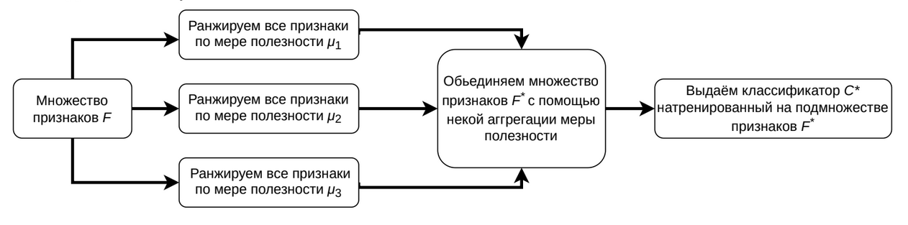

# Выбор признаков

- [Выбор признаков](#выбор-признаков)
  - [Уменьшение размерности](#уменьшение-размерности)
    - [Встроенный метод](#встроенный-метод)
    - [Метод-обёртка](#метод-обёртка)
    - [Фильтрующий метод](#фильтрующий-метод)
    - [Гибридный метод](#гибридный-метод)

## Уменьшение размерности

В задаче *уменьшение размерности* у нас имеется объекты, которые описаны признаками $\mathcal{F} = (f_1, \ldots, f_n)$, по которым мы хотим построить множество признаков $\mathcal{G} = (g_1, \ldots, g_k) : k < n$ (часто новое множество сильно меньше по мощности), переход к которым сопровождается наименьшей потерей информации. В данной задаче, помимо несильного уменьшения точности (допускается небольшое отклонение), мы добиваемся:

- Ускорение обучения и обработки
- Борьба с шумом и мультиколлинеарностью
- Интерпретация и визуализация данных (например, мы смогли свести данные к двумерному или трехмерному случаю)

**Проклятие размерности** (**curse of dimensionality**) - это набор проблем, возникающих с увеличением размерности, к таким проблемам относят:

- Технические сложности: увеличиваются требования к памяти и вычислительной мощности
- Ошибки объектов: например, могут увеличиваться расстояния между объектами, когда мы считаем kNN
- И другие: могут появиться случайные признаки, которые внезапно могут оказаться хорошими, что повлечёт к переобучению

Есть два основных метода уменьшения размерности: *выбор признаков* и *извлечение признаков*. Чем же они отличаются? Формально,

- **Выбор признаков** (**feature selection**) включает методы, для которых $\mathcal{G} \subset \mathcal{F}$. Они
  - быстро работают;
  - не могут "выдумывать" сложных признаков.
- **Извлечение признаков** (**feature extraction**) включает все другие методы (в том числе даже те, у которых $k > n$). Они
  - в целом, дольше работают;
  - могут извлекать сложные признаки.

Вкратце, выбор признаков - это то, что всегда берёт подмножеством существующие признаки, а извлечение признаков - это необязательно подмножества, это может быть ещё и новые признаки или преобразованные признаки.

Есть два вида ненужныз признаков,

- **Избыточные** (**redundant**) признаки не привносят дополнительной информации относительно существующих.
- **Нерелевантные** (**irrelevant**) признаки просто неинформативны.

Методы выбора признаков делятся на три основных метода, плюс, ещё один являющийся гибридом (или: ансамблем),

- *Встроенные методы* (*embedded*)
- *Фильтрующие методы* (*filter*)
- *Методы-обертки* (*wrapper*)

Стоит отметить, что помимо выбора признаков с точки зрения релевантности и не-релевантности также можно использовать выбор признаков для так называемого противоборствующего обучения. Набор признаков со времени может меняться, причем, если он меняется сильно, то это следует обнаруживать и как-то исправлять/преобразовывать, чтобы не образовывались искажения в ответах - так называемые *дрейф-статистики* - здесь нам нужно также *время появление объекта*.

### Встроенный метод

**Встроенные методы** (выбора признаков) - это методы выбора признаков, при которых этот выбор осуществляется в процессе работы других алгоритмов (классификаторов и регрессоров). Важно, что такие методы очень специфичны для каждого алгоритма, несмотря на то, что у нас есть более менее общий интерфейс оных.

Схема встроенного метода выглядит следующим образом:

1. Есть множество $\mathcal{F}$ - признаки.
2. Далее мы обучаем нашу модель на $\mathcal{F}'$ (совпадает с множеством всех признаков на первом шаге) на некоторый классификатор $C$.
3. Исходя из внутренних свойств $C$ мы выбираем подмножество $\mathcal{F}' \subset \mathcal{F}'$.
4. Переходим на п.2, если не выполнен критерий остановки. Иначе - вернуть в качестве ответа $\mathcal{F}'$.

Например, для случайного леса мы можем рассматривать число вхождений признака в дерево или глубину вершины вхождения признака в дерево.

### Метод-обёртка

**Методы-обёртки** - это такие методы, которые берут также существующие алгоритмы (но мы никаким образом не знаем про этот алгоритм) и здесь теперь сводим задачу выбора признаков к задаче оптимизации.

Можно сказать, что у нас есть $Q(\mathcal{F}) \to \mathbb{R}$ - функция качества от набора признаков, скажем, что у нас есть бинарный вектор из $0$ и $1$ (либо не берем признак, либо берём) - теперь есть функция $Q$, которая формирует по бинарному вектору какое-то подмножество $\mathcal{F}$, которое подставляется в другую функцию и считает качество.

Можем решать эволюционными алгоритмами.

Схема методов-обёрток выглядит следующим образом:

1. Есть множество $\mathcal{F}$ - признаки.
2. Выберем подмножество признаков $\mathcal{F}' \subset \mathcal{F}$.
3. Обучаем классификатор $C$ на $\mathcal{F}'$.
4. Если критерий остановки не удовлетворён, то п. 2, иначе п. 5.
5. Выдаём классификатор $C^{\star}$, натренированный на подмножестве признаков $\mathcal{F}^\star$.

Классификация методов-оберток: *детерминированные* и *стохастические*. В детерминированным относятся: *SFS* (*sequential forward selection*) - то, что постепенно добавляет признаки, *SBE* (*sequential backward elimination*) - то, что постепенно убирает признаки. В самом просто варианте это выглядит так: мы посчитали $Q(\mathcal{F}_1)$, $Q(\mathcal{F}_2)$, $Q(\mathcal{F}_3)$ - посчитали на всех признаках поотдельности, нашли лучший из них, например, $\mathcal{F}_3$, теперь на следующем шаге будем рассматривать $Q(\mathcal{F}_3, \mathcal{F}_1)$ и $Q(\mathcal{F}_3, \mathcal{F}_2)$ - и так со всеми признаками. *Стохастические* - сводят задачу выбора признаков к задаче оптимизации в пространстве бинарных векторов.

Преимущества:

- Более высокая точность, чем у [фильтров](#фильтрующий-метод)
- Используют отношения между признаками
- Оптимизируют качество предсказательной модели в явном виде

Недостатки:

- Очень долго работают
- Могут переобучиться при неправильной работе с разбиением набора данных

### Фильтрующий метод

Самый быстрый и худший по точности методы - **фильтрующие методы** - они пытаются оценить каждый признак какой-то мерой значимости и после этого отсортировать по данной значимости и выбрать наиболее значимые.

Схема фильтрующих методов:

1. Есть множество $\mathcal{F}$ - признаки.
2. Измеряем все метрики значимости признаков $f$ из $\mathcal{F}$.
3. Берём наиболее значимые $\mathcal{F}' \subset \mathcal{F}$ согласно правилу обрезки.
4. Тренировка классификатора $C$ на $\mathcal{F}'$.

Классификация фильтрующих методов: бывают *одномерные* и *многомерные*. Стоит отметить, что эти методы существуют только для отдельных рассматриваемых признаков и случаев задачи.

- Если у нас числовой параметр и наша задача - регрессия, то нам нужна мера, которая сравнит вектора чисел. Сюда подойдут Евклидово расстояние и, например, коэффициент корреляции (Пирсона или Спирмена).
- Есть меры, которые вычисляют взаимосвязь числового и категориального признаков. Сюда подойдут попарные расстояния (внутренние или внешние) и условная дисперсия.
- Есть меры, которые оценивают две категории: прирост информации (IGain), индекс Джини и $\chi^2$.

К многомерным относится более сложные и медленные, например, *транспонирование + кластеризация*.

Пример с корреляцией. Коэффициент корреляции Пирсона, наше значение лежит в $[-1, 1]$:

$$
  r = \dfrac{\sum_{ij}{\left((x_{ij} - \hat{x_j}) \cdot (y_i - \hat{y})\right)}}{\sqrt{\sum_{ij}{\left((x_{ij} - \hat{x_j})^2\right)} \cdot \sum_{i}{(y_i - \hat{y})^2}}}
$$

В случае же с корреляцией Спирмана мы

1. Сортируем объекты двумя способами (по каждому из признаков).
2. Находим ранги объектов для каждой сортировки.
3. Вычисляем корреляцию Пирсона между векторами рангов.

Теперь, выбрали один критерий полезности признака и получили оценки полезности всех признаков: $\mu_1$, $\mu_2$ и так далее. А как, собственно, выбрать из них?

- Число признаков. Выбираем ровно $n$ признаков.
- Порог значимости признаков. Скажем, что у нас есть $\mu'$ и будем брать всех, кто больше чем $\mu'$.
- Интегральный порог значимости признаков. Мы посмотрим на $\mu_1$, $\mu_1 + \mu_2$, $\mu_1 + \mu_2 + \mu_3$ и так далее - можно смотреть на такое, например, при нормированных $\mu$-значениях.
- Метод сломанной трости.
- Метод локтя.

Анализ одномерных фильтров.

- Преимущества:
  - Исключительно быстро работают
  - Позволяют оценивать значимость каждого признака
- Недостатки:
  - Порог значимости признаков
  - Игнорируют отношения между признаками и то, что реально использует предсказательная модель

Анализ многомерных фильтров.

- Преимущества:
  - Работают достаточно быстро
  - Учитывают отношения между признаками
- Недостатки:
  - Работают существенно дольше одномерных фильтров
  - Не учитывают то, что реально использует предсказательная модель

### Гибридный метод

**Гибридные методы** (выбора признаков) - это способы комбинаций алгоритмов выбора признаков. Самый частый вариант:

- сначала применим фильтр (или набор фильтров), отсеяв лишние признаки
- затем применим метод-обертку или встроенный метод

Схема самого простого гибрида:

1. Имеем множество признаков $\mathcal{F}$.
2. Применим на нём алгоритм выбора признаков $A_1$, получим выборку $\mathcal{F}'$.
3. Применим на $\mathcal{F}'$ алгоритм выбора признаков $A_2$, получим выборку $\mathcal{F}''$.
4. Вернуть в качестве результата - $\mathcal{F}''$.

Подход к ансамблированию состоит в построении ансамбля алгоритмов выбора признаков:

1. Имеем множество признаков $\mathcal{F}$.
2. Каждым из $n$ алгоритмов вы независимо выбираем подмножество $\mathcal{F}'$ признаков.
3. Затем, объединяем все эти множество в одно - $\mathcal{F}^{\star}$ по какому-нибудь критерию.
4. Выдаём классификатор $C^{\star}$ натренированный на подмножестве $\mathcal{F}^{\star}$.

Строим ансамбль предсказательных моделей:

1. Имеем множество признаков $\mathcal{F}$.
2. Каждым из $n$ алгоритмов вы независимо выбираем подмножество $\mathcal{F}'$ признаков.
3. На полученных подмножествах признаков обучать алгоритмы на классификаторы.
4. В качестве результата мы комбинируем несколько алгоритмов.

Объединяем ранжирования:

1. Имеем множество признаков $\mathcal{F}$.
2. Каждым из $n$ алгоритмов вы независимо выбираем подмножество $\mathcal{F}'$ признаков, но более мягко, ранжируя по мере полезности.
3. Объединяем множество признаков с помощью некой аггрегации (перестановок) этих множеств.
4. Выдаём классификатор $C^{\star}$ натренированный на подмножестве признаков $\mathcal{F}^{\star}$.

Объединяем меры значимости:

1. Имеем множество признаков $\mathcal{F}$.
2. Суммируем критерии качества по всем признакам по мерам полезности $\mu_i$.
3. Объединяем множество признаков с помощью некой аггрегации (перестановок) этих множеств.
4. Выдаём классификатор $C^{\star}$ натренированный на подмножестве признаков $\mathcal{F}^{\star}$.

Преимущество гибридных методов - чаще всего лучше по времени и по качеству. К недостаткам же относится: иногда мы не можем интерпретировать это, могут быть проблемы с переобучением.
