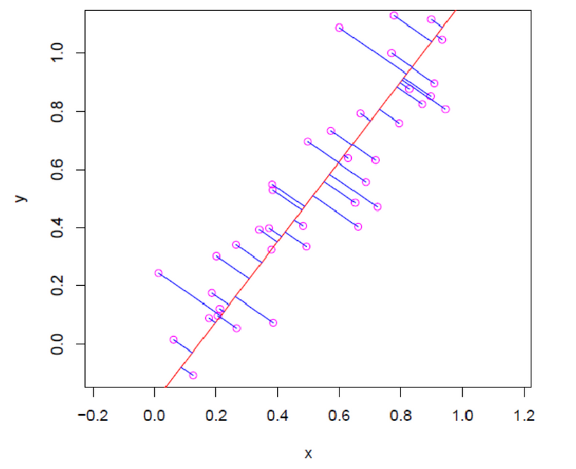
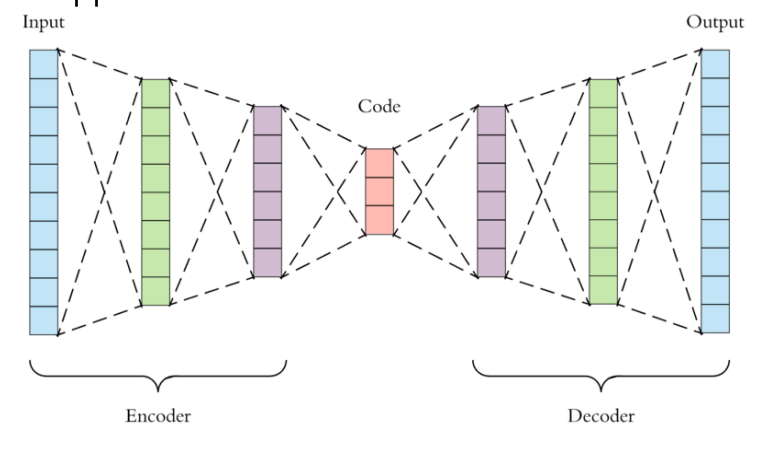
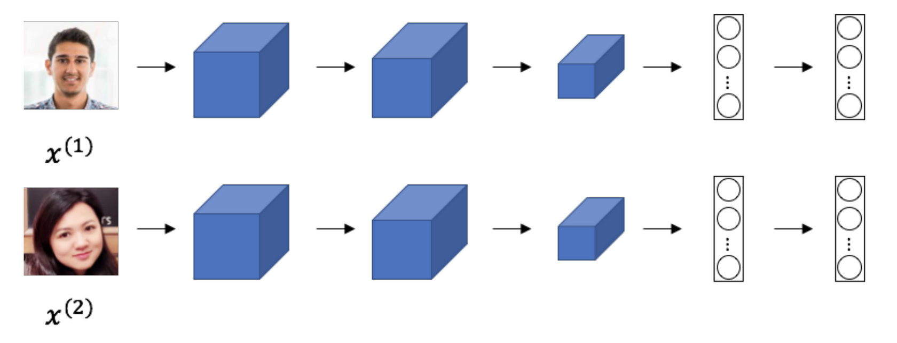
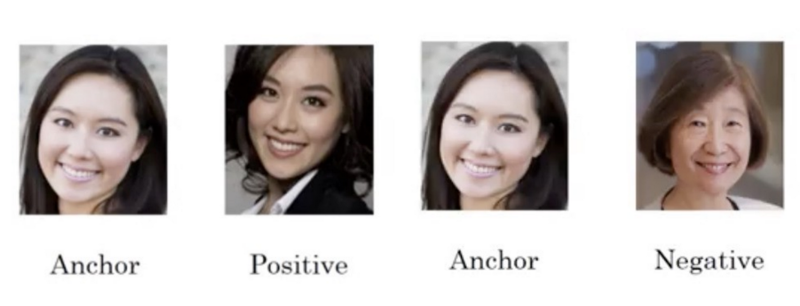
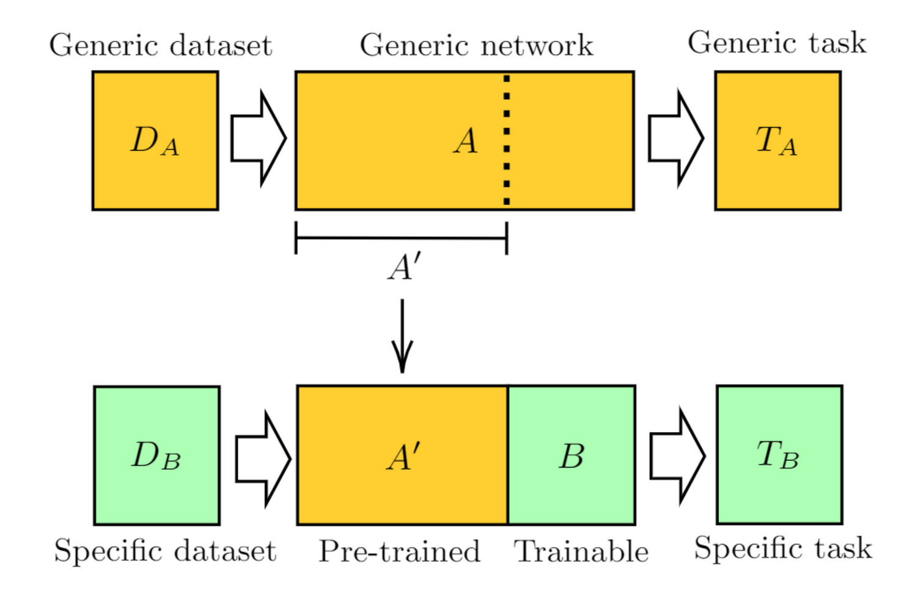

# Извлечение признаков

- [Извлечение признаков](#извлечение-признаков)
  - [Метод главных компонент (PCA)](#метод-главных-компонент-pca)
  - [Автокодировщики](#автокодировщики)
  - [t-SNE](#t-sne)
  - [Обучение на одном примере](#обучение-на-одном-примере)
  - [Перенос знаний](#перенос-знаний)
  - [Самообучение](#самообучение)
  - [Векторное представление слов](#векторное-представление-слов)

## Метод главных компонент (PCA)

Один из популярных методов извлечения признаков. Про разницу между извлечением и выбором [здесь](L11-FeatureSelection.md).

Сама по себе задача извлечения признаков - это задача *без учителя*. А раз это так, то нам нужно самим придумать функцию ошибки. В почти любой задаче обучения мы гарантируем, что нам даётся пространство $X$ и мы учимся получать "правильные ответы" из $Y$, но здесь их нету, а значит можно попробовать из $Y$ получить $X$. Более общий подход: мы преобразуем $X$ и $Y$ в другое пространство $Z$ и дальше сравниваем полученные результаты для оригинального и отображенного объекта $Z$.

Самая популярная задача в извлечении признаков - это визуализация данных. Мы хотим настолько упростить, при этом не потеряв точность, наши признаки, чтобы мы смогли изобразить в двумерном или трехмерном пространстве. То есть, говоря на языке матриц, мы хотим добиться, чтобы число столбцов было под число признаков, а строк - два. Мы можем это делать либо случайно (заполнив матрицу случайными числами, а затем помножив на нашу матрицу), либо более умным и осмысленным методом.

Одним из примеров такого преобразования - это *метод главных компонент* (*PCA*). Бывает линейным и нелинейным, первый более быстрый и легко интерпретируемый, второй же позволяет более сложные признаки.

В *одномерной* постановке задачи мы хотим проецировать все точки на линию: у нас есть данные и мы хотим найти такую линию, чтобы она минимизировала расстояние от объектов до этой линии, с другой стороны - нам хотелось бы иметь наибольшую дисперсию по проецированным точкам. Существует мнение, что эти условия на самом деле эквивалентны.

В *многомерном* пространстве мы можем накладывать какие-то другие требования, помимо вышеперечисленных, например,

- попытаться максимизировать расстояния между проекциями
- ещё хотелось бы, чтобы корреляция между осями проекций была равна нулю, то есть чтобы в нашем новом пространстве наши объекты были декоррелированы.

Применяя вот такое примитивное представление, можно построить алгоритм следующим образом: в начале мы ищем какую-ту одну прямую также, как мы это делали для одномерного случая, расстояние до которого минимально или дисперсия которой максимальная, фиксируем такую прямую и далее ищем следующую главную компоненту, но теперь мы будем искать среди всевозможных прямых (векторов), которые перпендикулярны предыдущему. Будем так делать, пока не накопим число компонент.

В более общем виде мы можем поставить задачу в матричном виде и сказать, что нас интересует матрица $G$, которая была получена из $F$, такая, что после восстановления объектов разница между оригинальными объектами из $F$ была минимальной:

$$
  \|GU^\mathrm{T} - F\|^2 \to \text{min},
$$

где $\text{rank}(U) = \text{rank}(G)$. Тут используется квадрат нормы - тот же MSE.

**Теорема**. Утверждается, что оптимальным решение будет - это воспользоваться *сингулярным разложением* и использовать собственные вектора матрицы $F^TF$ в качестве матрицы, которая будет выполнять преобразовать $U$ из $F \to G$, то есть $G = UF$, а обратное преобразование - $GU^\mathrm{T}$.

**Следствие**. Самое интересное, что из теоремы выходит, если решать задачу аналитически, то решением будет суммой оставшихся собственных чисел, так как мы проецируем из пространства большей размерности в меньшую.

Остаётся понять, сколько нам нужно взять число компонент для меньшего пространства. Если нам дано такое число, то столько и берём. В ином случае, нам нужно выбрать $k$ - чем-то похоже на задачу выбора признаков. В контексте PCA для выбора $k$ смотрится на число упущенной или потерянной информации, для этого применяется следующая формула:

$$
  E(k) = \dfrac{\|GU^{\mathrm{T}} - F \|^{2}}{\|F\|^{2}} = \dfrac{\lambda_{(k + 1)} + \ldots + \lambda_{(n)}}{\lambda_{(1) + \ldots + \lambda_{(n)}}},
$$

где $E(k)$ характеризует долю информации, теряемую при проекции. Поэтому для выбора $k$ можно смотреть на $E(k)$.

Подведём итоги, достоинства и недостатки PCA:

- В общем и целом, это линейное преобразование со всеми достоинствами и недостатками;
- Так как это линейное преобразование, то оно работает относительно быстро;
- Широко распространено для сжатия данных и визуализации, часто такой метод применяется и в других как первый шаг алгоритма;

## Автокодировщики

В каком-то смысле, *автокодировщики* - это обобщение [предыдущего](#метод-главных-компонент-pca) метода, то есть теперь наши преобразования мы заменяем на какие-то другие более сложные и произвольные функции, которые мы называем *глубокими сетям*.

**Автокодировщик** (**autoencoder**) - глубокая нейронная сеть, способная строить низкоразмерные представления данных за счет нелинейной трансформации.

Теперь, чтобы обучать, нам нужна функция ошибки и в качестве неё предлагается воспользоваться той же используемый в методе функцией, а именно мы подаём на вход автокодировщику объект и на выход автокодировщик должен выдать тот же самый объект. Для решения этой задачи есть два больших метода:

- Использовать какую-ту регуляризацию.
- Использовать так называемое "бутылочное горлышко" (bottleneck).

Архитектура бутылочного горлышко - это такая архитектура, у которой размерность пространства сужается, а затем начинает расширяться. Для нашего автокодировщика будет трудно обучиться какому-ту тождественному преобразованию, так как по архитектуре придётся сжать данные до какого-то вектора меньшего размера, а затем научиться восстанавливать обратно. Часть, которая сжимает, называют *кодировщиком*, а которая разжимает - *декодировщик*.

В методе с регуляризацией наши преобразования необязательно будут уменьшать размерности, могут как остаться таких же размерностей, так и увеличиваться вообще. В основном мы будем бороться с тождественным преобразованием через добавление некоторой регуляризации, то есть наша функция ошибок будет выглядеть так: мы будем подставлять объект в кодировщик, полученный вектор - в декодировщик, получать обратно объект в пространстве $X$ и затем будем добавлять регуляризационную добавку, например, $L$-норму.

$$
  \|d(c(x)) - x\| + \tau \cdot L(c(x)),
$$

где $c$ - кодировщик, $d$ - декодировщик, $L$ - некая регуляризация, $\tau$ - коэффициент регуляризации. Стандартно можно взять $L_1$ норму (как в LASSO).

Классификации автокодировщиков:

- Шумоподавляющий (denoising) автокодировщик - вносим в наш вектор шум, а потом требуем вектор без шума.
- Сжимающий (contractive) автокодировщик.
- Вариационный (variational) автокодировщик.

## t-SNE

Есть ещё один метод построения скрытого представления пространства меньшего размерности - это так называемое **стохастическое вложение соседей с t-распределением**. Этот метод нелинеен, может быть использован в визуализации. В отличие от остальных, мы пытаемся здесь сохранить взаимное расстояние между объектами в оригинальном пространстве и пространстве, на которое мы проецируем, то есть, если они были далеки друг от друга в оригинальном пространстве, то они должны были быть далёкими, иначе - близки в новом пространстве.

Как это можно формализовать? Мы можем:

1. Определим расстояния между точками, из расстояний получим вероятности того, что данная точка является соседом текущей. Почти также как в методе ближайших соседей.
2. Два распределения мы сравниваем как распределения.

Для сравнения распределений можно воспользоваться например **расстоянием** (или: **дивергенцией**) **Кульбака-Лейблера** (**KL divergence**) - расстояние между двумя распределениями $P$ и $Q$.

$$
  D_{\text{KL}}(P||Q) = \int_{-\infty}^{+\infty}{p(x)\log{\dfrac{p(x)}{q(x)}}\,\partial{x}},
$$

где $p$ распределено согласно $P$, а $q$ - согласно $Q$. Также называется *относительной энтропией*.

Поймем, как мы можем строить вероятности поподробнее. Как уже было сказано, мы это можем делать похожим образом как мы это делали в методе ближайших соседей: здесь мы используем нечто похожее на гауссово ядро и потом нормализуем полученные ядра, чтобы получить вероятности, делаем мы это для точек в оригинальном пространстве, делаем в целевом пространстве, и дальше мы сравниваем между собой распределения вероятностей.

$$
  \begin{aligned}
    p_{j|i} &= \dfrac{\exp{\left(\dfrac{-\|x_i - x_j\|^2}{2\sigma^2}\right)}}{\sum_{k \neq j}{\exp{\left(\dfrac{-\|x_i - x_k\|^2}{2\sigma^2}\right)}}} \\
    q_{j|i} &= \dfrac{\exp{\left(-\|y_i - y_j\|^2\right)}}{\sum_{k \neq j}{\exp{\left(-\|y_i - y_k\|^2\right)}}}
  \end{aligned}
$$

Есть модификация, которая использует симметричные распределения, здесь $p_{ij}$ будет средним между суммой $p_{j|i}$ и $p_{i|j}$, для $q_{ij}$ используется та же функция, но она нормализуется на всевозможные попарные расстояния.

$$
  \begin{aligned}
    p_{ij} &= \dfrac{p_{j|i} + p_{i|j}}{2|X|}, \\
    q_{ij} &= \dfrac{\exp{\left(-\|y_i - y_j\|^2\right)}}{\sum_{k \neq l}{\exp{\left(-\|y_k - y_l\|^2\right)}}}
  \end{aligned}
$$

Ещё одна модификация, так называемое *симметричное стохастическое вложение соседей c $t$-распределением*, здесь мы заменяем ядро Гаусса на другое ядро, которое использует распределение Стьюдента и это делается только для *целевого пространства*, для оригинального ничего не меняется.

## Обучение на одном примере

Данная задача похожа на задачу про *методы ближайших соседей* - задача обучения на одном (или малом) числе примеров решается эффективно через kNN. Когда у нас есть мало объектов для каждого класса и есть много классов, которые по числу также могут со временем меняться.

Формально, **обучение на одном примере** (**one-short learning**) - это постановка, в которой алгоритм должен дообучиться классификации на новый класс, содержащий всего один объект. **Обучение на нескольких примерах** (**few-short learning**) предполагает все то же, но с несколькими объектами.

Самый простейший пример такого - распознавание лиц сотрудников.

Как же решается такая задача? У нас есть два объекта и мы хотим посчитать между ними расстояние. Вот такая архитектура называется **сиамской сетью** - она вычисляет вектора в пространстве и после этого любым способом вычисляет расстояния между векторами (например, евклидово расстояние).

Для полученных векторов вычисляется расстояния, из них вычисляется **тройная ошибка** (**triplet loss**) - для его вычисления используется три объекта, так называемый "якорный" (anchor), "позитивный" (positive) и "негативный" (негативный):

$$
  \mathcal{L}(a, p, n) = \max{(\text{dist}(a, p) - \text{dist}(a, n) + \varepsilon, 0)}
$$

Нам бы хотелось бы, чтобы позитивный объект (например, другая фотография одного и того же человека) была бы близка к якорному объекту и, наоборот, негативный объект (например, фотография вообще другого человека) был бы далёк от них.

Как мы обучаем? На стадии обучения наша сеть будет обучаться по батчам троек объектов градиентном спуском. А как выводим? На стадии вывода мы берём объекты и подставляем в нашу сеть.

## Перенос знаний

В каком-то смысле мы уже рассмотрели метод *переносом знаний* [ранее](#обучение-на-одном-примере), но давайте рассмотрим в общем виде. У нас есть какая-та задача $A$, которая обучена на каком-то наборе данных $\mathcal{D}_{A}$ и далее для решения другой задачи $B$, для которой входные объекта того же типа, что и входные объекты в первом наборе данных. В таком случае, мы можем взять функцию, которой мы обучали решать задачу (глубокая сеть), вытащить часть преобразований $A'$ и встроить в другую функцию, потому что это были преобразования, которые хорошо первого типа $A$.

Самый простой пример, где это может быть, например, разметка изображений для неразмеченных изображений (на уже готовых моделях). Для чего вообще такой подход?

- Перенос знаний можно использовать для основной задачи - извлечения признаков.
- Иногда предобученную часть, взятую из решения другой задачи, *дообучают*. Для этого её параметры "размораживаются" (то есть, до этого никак не изменялись) после того, как другая часть функции достаточно хорошо обучится.

## Самообучение

Помимо того, чтобы решать задачу по предсказанию признаков, а потом переносить знания, мы можем по тому же принципу придумывать самим себе задачи и переносить из них знания. Такой принцип называют **самообучением**. Для чего такое нужно? Может быть такое, что объектов много, но мало меток, и мы хотели бы эффективно предобучиться на объектах без меток. Теперь мы будем придумывать задачу, придумывать разметку и обучаемся предсказывать придуманную разметку.

Формально, **самообучение** (**self-supervised learning**) - подход, в котором для обучения представлений используются задачи, в которых разметку можно получить автоматически.

Например, в качестве разметки можем взять поворот картинки. Будем брать картинку, поворачивать на какой-нибудь угол и дальше просить алгоритм определить, какой угол.

## Векторное представление слов

Модели машинного обучения умеют также работать с текстами. Как получить векторное представление текста? Число слов в словаре великое множество и они все из себя представляют категориальные переменные. Давайте зафиксируем размер словаря $|V|$, пронумеруем все слова $i(w)$ и затем будем представлять каждое слово $w$ в виде вектора $\left(0_1, \ldots, 0_{i(w) - 1}, 1_{i(w)}, 0_{i(w) + 1}, \ldots 0_{|V|}\right)$.

Как нам на таком обучаться? Гипотеза: слова, встречающиеся в похожем контексте будут иметь один и тот же смысл. Идея: будем характеризовать слова контекстом, в котором они встречаются. Есть два подхода обучения.

- *Continuous bag of words*. Предполагает, что мы по контексту слова (то есть, мы берём несколько слов подряд и выкидываем центральное слово) будем пытаться предсказывать слово (то, что мы выкинули), где *контекстом* будем считать соседними словами этого убранного слова.
- *Skip-gram*. Здесь - наоборот - мы пытаемся по слову предсказать его контекст.

Как это обучать? Берём текст, нарезаем его на эти батчи (например, Skip-gram) и обучаем. Применяем здесь также негативное сэмплирование (negative sampling) для создания отрицательных примеров. После обучения мы получаем как бы модели реальных векторов в алгебре, которые мы можем как-то использовать и считать в дальнейших задачах.
