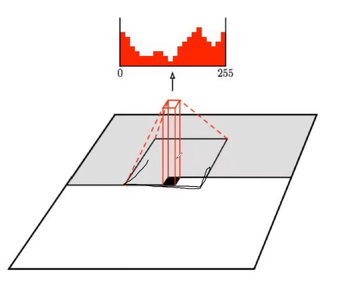
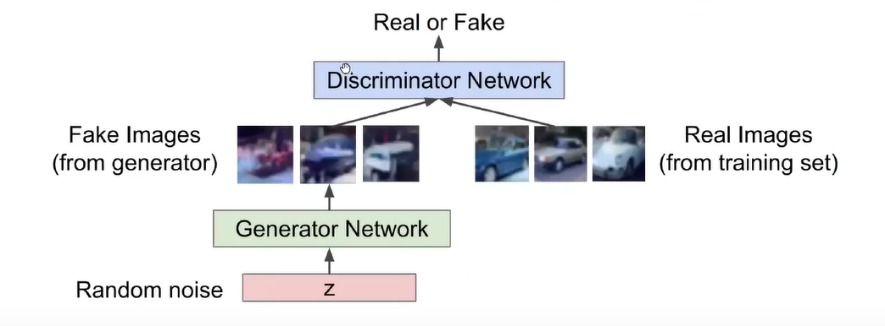
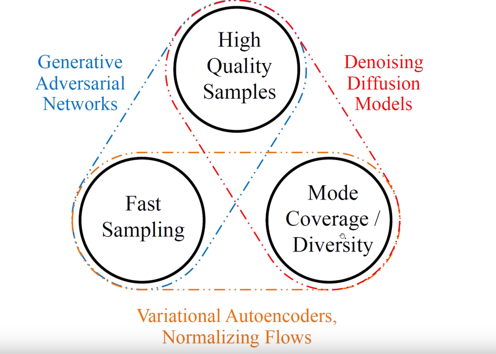

# Генеративные методы

Генерацию новых объектов трудно формализовать. Чаще всего эту задачу относят к классу без учителя. Так как алгосу надо найти самому закономерность(распределение) на данных.

Как оценивать качество генерации?

1. перекрестная энтропия
2. Дивергенция Кульбака-Лейблера(Относительная энтропия P по отношению к Q) (св-ва: нессиметрична, не является расстоянием)

Бывают явные и неявные модели генерации.

процесс генерации - процесс генерации следующей части нашего объекта. Случайно геним начало, потом на основе прошлых геним следующие параметры. Каждая часть упрощенно может быть категорией. Например, вот получили текст вида word1 word2 word3. У каждого слова определим вероятность с которой мы будем использовать его для след слова, и таким образом построим новое выбрав случайное из прошлых.

Есть эвристика, которая чистит прошлые уже сгененные слова...

## PixelRNN

Нечто похожее на динамическое программирование.

    * Начинаем с левого верхнего угла подсчет.
    * правило перехода: pixel[i][j] = f(pixel[i - 1][j], pixel[i][j - 1])

## PixelCNN

Медленный. Использует сразу пачку подсчитанных заранее отдельных частей объекта.

Пример:

Автокодировщики

По сути извлекаем какие-то фитчи из данных и потом можем по ним восстановить данные.

Обучение VAE??

## GAN

Основная идея: Берем реальные объекты и сгенерированные. Даем "эксперту", пусть отличит реальность от фальши.

**Важно** что такая бинарная классификация фальши от настоящих объектов должна запускаться **одновременно** с генерацией.

Итого имеем 2 нейкронки:

* Дискриминатор - нейронка, пытающася различить объекты
* Генератор - его цель обмануть дискриминатор  

Сложная функция ошибки:

c

Видим, что нужно что-то максимизровать - заиспользуем град подъем.

## CGAN (cycle GAN)

На примере это выглядит так: Предположим, что мы из картинки зебры хотим получить лошадь. Для этого заведем 2 генератора. Из лошади в зебру и наоборот. И к каждому генератору сопоставим дискриминатор.

## Доменная адаптация

Основная мысль:

Есть размеченные данные, есть неразмеченные данные похожие на первый датасет. Хотим доразметить те данные.

Решение: извлекаем фитчи от размеченного и переприменяем на неразмеченном...

## Общая схема диффузионных моделей

Берем исходное изображение, добавляем шум. То есть мы знаем как нужно избавиться от шума, чтобы получить значение. Так как мы его сами нанесли. И модель учится убирать этот шум... Возможно с каким-то условием

## Общие факты про GAN, доменную адаптацию и диффузионные модели

* У диффузионных хорошее качество результата + они медленные
* Автокодирощики быстро работают, генят разнообразно, но качество плохое
* Ганы могут быстро работать высокое качество, плохое разнообразие.

Картинка для запоминания:

