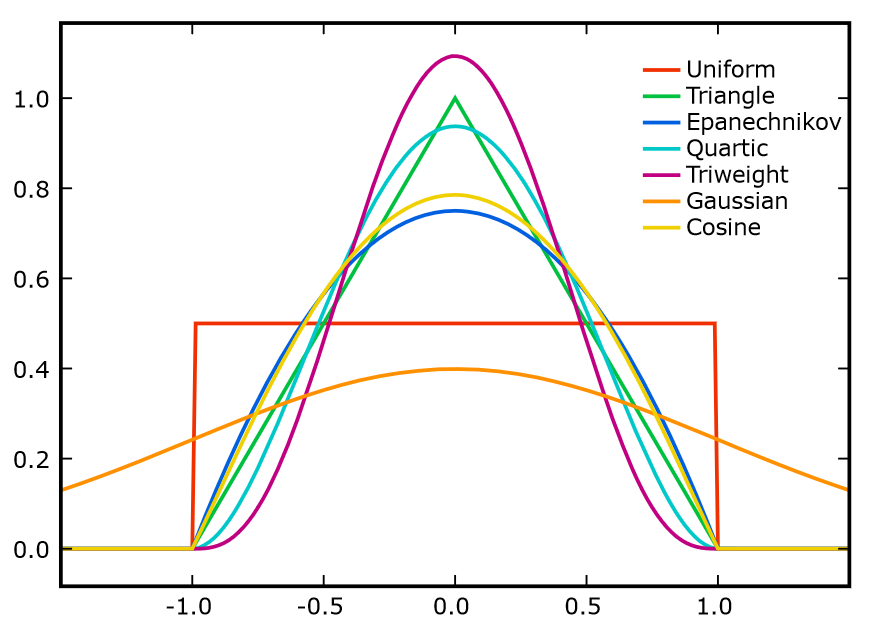

# Непараметрические и метрические модели

- [Непараметрические и метрические модели](#непараметрические-и-метрические-модели)
  - [Классификация на основе похожести](#классификация-на-основе-похожести)
    - [Метрики](#метрики)
      - [Расстояние Минковского](#расстояние-минковского)
      - [Косинусные меры](#косинусные-меры)
      - [Расстояние Махаланобиса](#расстояние-махаланобиса)
  - [Метод ближайших соседей](#метод-ближайших-соседей)
    - [Метод одного ближайшего соседа](#метод-одного-ближайшего-соседа)
    - [Метод $k$-ближайших соседей](#метод-k-ближайших-соседей)
      - [Ядерное сглаживание](#ядерное-сглаживание)
      - [Окно Парзена–Розенблатта](#окно-парзенарозенблатта)
      - [Окно Парзена–Розенблатта для классификации](#окно-парзенарозенблатта-для-классификации)
  - [Непараметрическая регрессия](#непараметрическая-регрессия)
    - [Технические трудности](#технические-трудности)
  - [Другие задачи](#другие-задачи)

## Классификация на основе похожести

Напоминание про задачу классификации нам даны следующие сущности:

- $X$ - пространство объектов;
- $Y$ - множество меток (категория объекта);
- $y : X \to Y$ - неизвестная зависимость между объектами
- $\mathcal{D} = \{(x_i, ~ y_i)\}$ - обучающее множество

Наша задача это найти такой алгоритм $a : X \to Y$, который бы приближал (или аппроксимировал) значение $y$ на $X$, то есть наиболее точно предсказывал категорию объекта $x \in X$.

*Похожестью* объектов мы назовем мерой сходства между объектами. В качестве такой меры можно рассматривать **расстояния** (или: **метрики**).

**Метрическое пространство** - это множество с заданной на нем метрикой

$$
    \rho(a, ~ b) : X \times X \to [0; ~ +\infty)
$$

**Аксиомы метрики**: симметрия, неравенство треугольника, различимость нетождественных объектов, неразличимость тождественных объектов.

### Метрики

Здесь рассматриваются некоторые из известных методов получения расстояния (схожести) между объектами.

#### Расстояние Минковского

В общем случае (то есть, при $p \in \mathbb{R}_{+}$) **расстояние Минковского** выглядит следующим образом:

$$
    \rho(a, ~ b) = \left(\sum_{i}{\left|a_i - b_i\right|^{p}}\right)^{\dfrac{1}{p}}
$$

Есть некоторые известные частные случаи это метрики:

- при $p = 1$ это **Манхеттенское расстояние**:

    $$
        \rho(a, ~ b) = \sum_{i}{\left|a_i - b_i\right|}
    $$

- при $p = 2$ это **Евклидово расстояние**:

    $$
        \rho(a, ~ b) = \sqrt{\sum_{i}{\left(a_i - b_i\right)^2}}
    $$

- изощрённый случай, $p = \infty$ это **расстояние Чебышёва**:

    $$
        \rho(a, ~ b) = \max_{i}{\left|a_i - b_i\right|}
    $$

#### Косинусные меры

*Косинусное расстояние* определяется через **косинусное сходство**:

$$
    \text{CosineSimilarity}(a, ~ b) = \dfrac{\sum_{i}{a_i \cdot b_i}}{\sqrt{\sum_{i}{a_i^2}} \cdot \sqrt{\sum_{i}{b_i^2}}} \in [-1; +1]
$$

**Косинусное расстояние** определяется следующим образом:

$$
    \text{CosineDistance}(a, ~ b) = 1 - \text{CosineSimilarity}(a, ~ b) \in [0; ~ 2]
$$

Если набор данных может быть специфичным образом нормализован, тогда мы считаем косинусное расстояние следующим способом:

$$
    \text{CosineDistance}(a, ~ b) = \sum_{i}{a_i \cdot b_i} = \left\langle a, ~ b \right\rangle
$$

#### Расстояние Махаланобиса

**Расстояние Махаланобиса** считается по следующей формуле:

$$
    \rho(a, ~ b) = \sqrt{\left(a - b\right)^T S^{-1} \left(a - b\right)},
$$

где $S$ - это матрица ковариации пространства $X$ (это матрица, составленная из попарных ковариаций элементов двух случайных векторов $a, b \in X$). Данная матрица имеет встроенную нормализацию.

## Метод ближайших соседей

Самый простой и универсальный алгоритм, который строится вокруг идеи расстояний между объектами для задачи классификации - это *метод ближайших соседей*.

### Метод одного ближайшего соседа

Идея модели: пусть есть некий объект $x$, к которому мы установить классификацию. Тогда, давайте посмотрим на все остальные объекты из выборки $X$, определим расстояние до каждого из них и возьмем классификацию того, с кем расстояние меньше всего.

Формально, пусть $x_{(u, ~ 1)}$ - *ближайший сосед* объекта $u$:

$$
    x_{(u, ~ 1)} = \argmin_{x \in \mathcal{D}_{\text{train}}}{\rho(u, ~ x)}
$$

Классификатор *одного ближайшего соседа*:

$$
    a_{\text{1NN}}{\left(u, ~ \mathcal{D}_{\text{train}}\right)} = y\left(x_{(u, ~ 1)}\right)
$$

Какие преимущества? Очень простая реализация, понятность. Какие недостатки? Такой подход очень чувствителен к шуму, даже если такого нету то мы все равно наблюдаем низкую качество работы, наконец, наше обучение модели зависит только от данных.

### Метод $k$-ближайших соседей

Улучшим [предыдущий вариант](#метод-одного-ближайшего-соседа) по качеству работы. Давайте будем брать не одного, а $k$ соседей (новый параметр) и выберем расстояние (метрику) $\rho$. Тогда, мы отсортируем наши объекты по расстоянию относительно $u$:

$$
    \rho(u, ~ x_{(u, 1)}) \leqslant \rho(u, ~ x_{(u, 2)}) \leqslant \rho(u, ~ x_{(u, 3)}) \leqslant \ldots \leqslant \rho(u, ~ x_{(u, \left|\mathcal{D}_{\text{train}}\right|)})
$$

Выберем первые $k$ соседей и среди них будем искать чаще всех встречающийся класс и выберем его для нашего объекта. Здесь у нас может возникнуть проблема неопределенности, если вдруг окажется, количество объектов двух или больше классов оказалось равно количество. А почему такое происходит? Проблема вся в том, что подсчитывая расстояния до объектов мы сопоставляли всем объектом одинаковую величину "нужности" данного объекта, то есть насколько нам вообще может быть интересен тот или иной более дальний объект.

Давайте на основе расстояний от искомого объекта до всех остальные построим весовую функцию $w_{(i, ~ u)}$ - функция значимости $i$-го соседа $u$, *апостериорный вес*.

> Есть также *априорные веса* $w_i$ - это те, которые не зависят от запроса, грубо говоря, являются *начальными весами*. Не стоит их путать с апостерироными!
>
> Если требуется одновременно учитывать веса априорные и апостериорные веса, то $w_{(i, ~ u)} = w_i \cdot w'_{(i, ~ u)}$.

Тогда, давайте просто домножим функцию определения соседа на соответствующий вес в зависимости от того, насколько ближе или дальше расположен искомый объект выборки от искомого объекта $u$.

$$
    a_{\text{GenDistClassifier}}(u, ~ \mathcal{D}_{\text{train}}) = \argmax_{y \in Y}{\sum_{i}^{\left|\mathcal{D}_{\text{train}}\right|}{\left[y(x_{(u, ~ i)} = y\right] \cdot w_{(i, ~ u)}}}
$$

#### Ядерное сглаживание

**Ядерная функция** $K(x)$ - это симметричная неотрицательная функция, $\int_{-\infty}^{+\infty}{K(x)\,\partial{x}} = 1$.

Замечаем, что это то, что нам нужно - чем дальше от расстояния (в данном случае, от точки $0.0$), тем меньше значение. Здесь представлены следующие ядерные функции:

- $\text{Uniform}(u) = \dfrac{1}{2} \cdot [u < 1]$
- $\text{Triangular}(u) = (1 - |u|) \cdot [u < 1]$
- $\text{Epanechnikov}(u) = \dfrac{3}{4} \cdot (1 - u^2) \cdot [u < 1]$
- $\text{Gaussian}(u) = \dfrac{1}{\sqrt{2\pi}} \cdot \exp{\left(\dfrac{-u^2}{2}\right)}$

#### Окно Парзена–Розенблатта

Пусть есть некоторая вероятностная мера $Pr([a, b])$, которая определена на $[a, b]$ (некоторое пространство), тогда наша оценка плотности будет таковой:

$$
    p(x) = \lim_{h \to 0}{\dfrac{1}{2h}Pr([x - h, x + h])},
$$

где $h$ - это наше окно. Эмпирическая оценка вероятности с окном шириной $h$ будет выглядеть следующим образом:

$$
    \hat{p_{h}}(x) = \dfrac{1}{2nh} \cdot \sum_{i = 1}^{n}{\left[\left|x - x_i\right| < h\right]}
$$

Наконец, поделим на $h$ и придём к **оценке Парзен-Розенблатта** для одномерного случая с шириной $h$:

$$
    \hat{p_{h}}(x) = \dfrac{1}{2nh} \cdot \sum_{i = 1}^{n}{K\left(\dfrac{x - x_i}{h}\right)},
$$

где $K(r)$ - некоторая ядерная функция. А теперь рассмотрим для многомерного случая: если объекты описываются $m$ вещественными признаками $f_j: X \to \mathbb{R}$, $j = 1, \ldots, m$.

$$
    \hat{p_h}(x) = \dfrac{1}{n} \cdot \sum_{i = 1}^{n}{\prod_{j = 1}^{m}{\dfrac{1}{h_j} \cdot K\left(\dfrac{f_j(x) - f_j(x_i)}{h_j}\right)}}
$$

А если мы скажем, что $X$ - это метрическое пространство с мерой расстояния $\rho(x, x')$:

$$
    \hat{p_h}(x) = \dfrac{1}{nV(h)} \cdot \sum_{i = 1}^{n}{K\left(\dfrac{\rho(x, x_i)}{h}\right)},
$$

где $V(h) = \int_{X}{K\left(\dfrac{\rho(x, x_i)}{h}\right)\,\partial{x}}$ - это множитель нормализации.

#### Окно Парзена–Розенблатта для классификации

Фактически здесь и получаем два вида алгоритма метода ближайших соседей с использованием ядерной функции и Парзенского окна. С фиксированной шириной окна:

$$
    a(u, ~ \mathcal{D}_{\text{train}}, ~ h, ~ K) = \argmax_{y \in Y}{\sum_{i = 1}^{|\mathcal{D}_{\text{train}}|}{[y(x_{(u, i)}) = y] \cdot K\left(\dfrac{\rho(u, x_{(u, i)})}{h}\right)}}
$$

С нефиксированной шириной окна:

$$
    a(u, ~ \mathcal{D}_{\text{train}}, ~ k, ~ K) = \argmax_{y \in Y}{\sum_{i = 1}^{|\mathcal{D}_{\text{train}}|}{[y(x_{(u, i)}) = y] \cdot K\left(\dfrac{\rho(u, x_{(u, i)})}{\rho(u, x_{(u, k + 1)})}\right)}}
$$

## Непараметрическая регрессия

Напоминание про задачу регрессии, нам данные следующие сущности:

- $X$ - пространство объектов, $Y$ - множество меток;
- $y : X \to Y$ - неизвестная зависимость, $Y \subseteq \mathbb{R}$;
- $\mathcal{D} = \{(x_i, y_i)\}$ - обучающее множество.

Наша задача найти такой алгоритм $a : X \to Y$, приближающий $y$ на $X$, причем гипотеза о компактности заменяется теперь на гипотезу непрерывности, так как пространство перестаёт быть дискретным.

Представим себе нашу функцию $a_0(x, \mathcal{D}_{\text{train}}) = \delta$, она линейная в некоторой области искомого объекта $u$. Попробуем выразить для неё формулу эмпирического риска:

$$
    \mathcal{L}(\delta) = \sum_{i = 1}^{|\mathcal{D}_{\text{train}}|}{w_{(i, u) \cdot (\delta - y(x_i))^2}}
$$

Мы хотим решить задачу минимизации, если мы попытаемся решить эту задачу аналитически, то мы получим оптимальное решение - это среднее взвешенное. Формула (**ядерное сглаживания Надарая-Ватсона**) в этом случае такая:

$$
    \begin{align}
        a_{\text{NPR}}(u, \mathcal{D}_{\text{train}}) &= \dfrac{\sum_{i = 1}^{|\mathcal{D}_{\text{train}}|}{y_iw_{(i, u)}}}{\sum_{i = 1}^{|\mathcal{D}_{\text{train}}|}{w_{(i, u)}}} \\
        &= \dfrac{\sum_{x_i \in \mathcal{D}_{\text{train}}}{y_iK\left(\dfrac{\rho(x_i, u)}{h}\right)}}{\sum_{x_i \in \mathcal{D}_{\text{train}}}{K\left(\dfrac{\rho(x_i, u)}{h}\right)}}
    \end{align}
$$

В $(1)$ мы берем значения каких-то соседей с заданными весами и делим на сумму весов - получаем среднее взвешенное.

Подведём некоторые итоги относительно регрессии:

- фактически, $k$-NN - это тоже своего рода регрессор с One-Hot преобразованием;
- выбор функции ядра влияет на гладкость функции потерь, однако он не влияет особо на итоговое качество;
- выбор параметра окна (если фиксированное, $h$) или количество соседей ($k$) влияет на качество приближения;

### Технические трудности

Как уже упоминалось в начале, нам нужно считать расстояния. Причем много и часто, и делать нужно это быстро, так как объектов в выборке много. Простая сортировка в скором времени упирается в время исполнения и становится в скором времени сильно замедленным.

Довольно часто люди пользуется такой структурой данных как **k-d-деревья**. Важно, что точность расстояний в этой структуре данных аппроксимируется ради ускорения, но при этом итоговый результат не меняется.

## Другие задачи

Метод ближайших соседей используются во многих задачах и даже порой экстремальных, например, *Few-Shot learning*:

- Обучение на малом числе примеров;
- Большое число классов;
- Множество классов может меняться;
- Для каждого класса малое число примеров;
- *Основная задача* (классификация) решается при помощи 1NN;
- *Подзадача* (выделение признаков): построить пространство, в котором будет вычисляться расстояние.

Еще одна задача SMOTE - используется для семплирования, генерация синтетических объектов. Алгоритм:

1. Случайно выбрать точку $a$;
2. Выбрать $k$ ближайших точек из её класса;
3. Случайно выбрать из них одну, $b$;
4. Случайно выбрать точку на отрезке $(a, b)$;
5. Добавить её с той же меткой класса, что и у $a$.

И ещё одна задача - поиск связей Томека. Данная задача решает проблему следующего вида: пары объектов разных классов оказываются близкие друг другу. Такие объекты скорее всего нарушают гипотезу компактности, а значит нам нужно что-то сделать, чтобы создать полноценный классификатор объектов. Фактически задача состоит в следующем:

1. Выделить связи, то есть построить множества близко лежащих пар объектов;
2. Далее предлагается:
   1. Удалить оба объекта;
   2. Удалить объект мажоритарного класса;
   3. Изменение метки объекта мажоритарного класса.

Наконец, LOWESS. Вместо злостного удаления объектов давайте мы их будем учитывать с меньшим априорным (или: локальным) весом $w_i$.

$$
    w_i = K(y(x_i) - a_{\text{kNN}}(x_i, \mathcal{D}_{\text{train}} \setminus \{x_i\}))
$$

Здесь мы немного хитрим с функцией ядра $K$: необязательно, чтобы $K$ совпадало с функцией ядра модели. Взвешивание можно повторять итеративно. На практике применяется kNN, так как он позволяет эффективно менять тренировочное множество $\mathcal{D}_{\text{train}}$.
