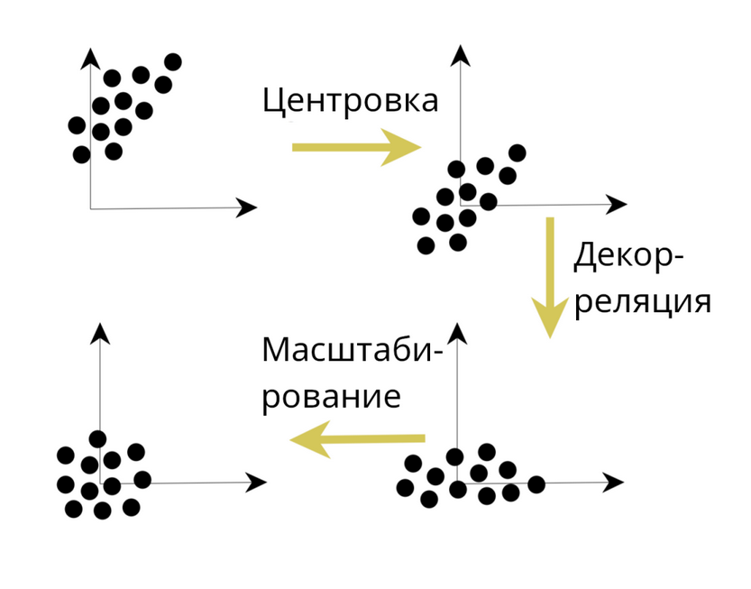
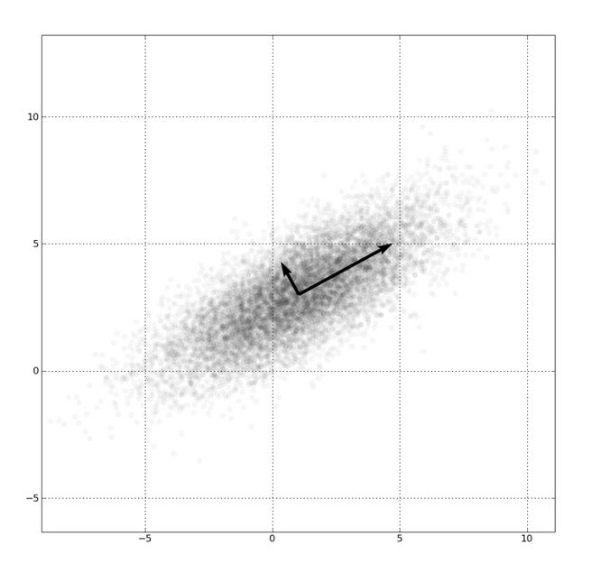

# Линейные методы

- [Линейные методы](#линейные-методы)
  - [Нормализация](#нормализация)
    - [Декорреляция](#декорреляция)
      - [Гауссиан](#гауссиан)
      - [Сингулярное разложение (SVD)](#сингулярное-разложение-svd)
      - [Метод главных компонент (PCA)](#метод-главных-компонент-pca)
  - [Линейная регрессия](#линейная-регрессия)
    - [Гребневая регуляризация](#гребневая-регуляризация)
    - [Коэффициент сдвига (свободный параметр)](#коэффициент-сдвига-свободный-параметр)
    - [Итоги к линейной регрессии](#итоги-к-линейной-регрессии)
  - [Линейная классификация](#линейная-классификация)
  - [Логистическая регрессия](#логистическая-регрессия)
  - [Градиентный спуск](#градиентный-спуск)
    - [Другие виды стохастического спуска](#другие-виды-стохастического-спуска)
      - [Стохастический градиентный спуск](#стохастический-градиентный-спуск)
      - [Стохастический средний градиентный спуск](#стохастический-средний-градиентный-спуск)
      - [Пакетный градиентный спуск](#пакетный-градиентный-спуск)
    - [Проблемы и эвристики стохастического спуска](#проблемы-и-эвристики-стохастического-спуска)
  - [Регуляризация](#регуляризация)
    - [Про гребневую регуляризацию](#про-гребневую-регуляризацию)
    - [Лассо Тибширани](#лассо-тибширани)
    - [L1-регуляризация](#l1-регуляризация)
    - [Регуляризация в целом](#регуляризация-в-целом)

## Нормализация

При работе с любыми данными мы начинаем с их нормализации, чтобы в будущем иметь более лучшие модели на дальнейшее обученеи и предсказание.

### Декорреляция

Начнём с декорреляции. Предположим, что нам подаются данные уже *центрированные* (то есть те, которые прошли *центровку*), то есть часть нормализации уже сделали: $\mathbb{E}[X_j] = 0$.

Посчитаем *ковариационную матрицу*: $\Sigma(X) = \dfrac{1}{N}X^{T}X$. Теперь выделим из него корень ($\Sigma^{1/2}$ - *разложение Холецкого*), возьмем от неё обратную и умножим на матрицу $X$ мы получим декоррелированные данные - *декорреляция*.

$$
    \hat{X} = X \times \Sigma^{-1/2}(X)
$$

Весь процесс можно описать следующим образом: получив данные в разложении в виде *эллипса*, мы распределяем их в *окружность*.

Мы делаем нечто похожее на декорреляцию, когда вычисляем *расстояние Махаланобиса*, потому что там мы брали обратную матрицу от матрицы ковариации и умножали на него векторы. Это же формула используется и в вычислении плотности многомерного гауссиана:

$$
    f_{\mu, \Sigma}(x) = \dfrac{\exp{\left(-\dfrac{1}{2}(x - \mu)^T\Sigma^{-1}(x - \mu)\right)}}{\sqrt{(2\pi)^k|\Sigma|}}
$$

#### Гауссиан

Гауссиан в многомерном пространстве выглядит так - её главная ось может не совпадать в осями координат - это соответствует тому, что матрица ковариации недиагональная.

Поскольку мы умеем считать плотность, то мы умеем явно решать задачу классификации. Предположим, что у нас есть два множества, опишем их гауссианоми. Теперь для некоторой точки $x$ мы посчитаем плотность относительной первой гауссиана (для первого класса), посчитаем плотность относительно второго (для второго класса) - у кого больше плотность, того и классификация точки.

Также мы можем решать задачу генерации точек. Здесь нам потребуется вычисления корня и матрицы.

- $\Sigma = A^TA$ - матрица ковариации раскладывается на произведение двух матриц (одна из которых транспонированная);
- $z_i \gets \mathcal{N}(0, 1)$ - возьмем значение из нормального распределения (независимые координаты) по каждой из координат;
- $x \gets zA + \mu$ - генерация точки из произведения сгенерированного из нормально распределения на полученную матрицу и прибавляем вектор сдвига.

#### Сингулярное разложение (SVD)

Здесь также можно использовать так называемое *сингулярное разложение (SVD)*. Предположим, у нас есть некоторые данные. Также предположим, что деформировать мы их можем только по осям координат, что будет соответствовать тому, что мы умножаем на диагональную матрицу. Например, мы можем сделать его более "вытянутым" по оси $x$ (то есть, превратить в эллипс). А далее мы хотим повернуть его в какую-ту сторону с помощью трансформирующей матрицы. SVD выглядит так: $F = VDU^{\mathrm{T}}$, где $V$ отвечает за данные, $D$ - за деформацию, $U$ - матрица поворота.

**Теорема**. Любая матрица $F$ размера $n \times m$ может быть представлена в виде сингулярного разложения $F = VDU^T$, где

- $V = (v_1, ~ \ldots, ~ v_m)$ размера $n \times m$, являющаяся ортогональной: $V^TV = I_m$, столбцы $v_j$ - собственные вектора матрицы $FF^T$
- $D = \text{diag}{(\sqrt{\lambda_1}, ~ \ldots, ~ \sqrt{\lambda_m})}$ размера $m \times m$, $\sqrt{\lambda_j}$ - **сингулярные числа**, квадратные корни собственных значений $F^TF$
- $U = (u_1, ~ \ldots, ~ u_m)$ размера $m \times m$, являющаяся ортогональной: $U^TU = I_m$, столбцы $u_j$ - собственные вектора матрицы $F^TF$.

По другому мы можем представить себе следующим образом: представим какое-то скрытое пространство, в которое мы хотим проецировать данные. Тогда,

- $V$ представляет, как объекты соответствуют базисным векторам,
- $D$ представляет важность каждого базисного вектора,
- $U$ показывает, как признаки соответствуют базисным векторам.

#### Метод главных компонент (PCA)

Возьмем матрицу $X$ в SVD-разложении и её коварицонной матрицы, то есть

- $X = VDU^{\mathrm{T}}$ - сингулярное разложение $X$;
- $\Sigma = \dfrac{1}{n}X^{\mathrm{T}}X$ - ковариация;

Подставим одно в другое и получим:

$$
    \begin{aligned}
        \Sigma &= \dfrac{1}{n} X^{\mathrm{T}}X \\
        &= \dfrac{1}{n} U D^{\mathrm{T}} V^{\mathrm{T}} V D U^{\mathrm{T}} \\
        &= U \dfrac{D^{2}}{n} U^{\mathrm{T}}
    \end{aligned}
$$

Посмотрим на корень матрицы $\Sigma$: $\Sigma^{1/2} = U^{\mathrm{T}}\dfrac{D}{n}$ - полученная матрица поворачивает данные в *обратном направлении*. Заметим, что делая сингулярное разложение мы можем посмотреть, как будут располагаться наши данные вдоль каждой оси (то есть, вдоль каждого собственного вектора (то есть, столбцы $U_j$ и будут собственными векторами)) и исходя из этого понимать, как столбцы дальше нам брать.

## Линейная регрессия

Задача линейной регрессии состоит следующим образом. Имеется некоторая функция $f(x, \theta)$, которая зависит от $x$ и обучаемых параметров $\theta$ (то есть, функция предсказания), сама функция представляет из себя скалярное произведение (то есть, сумму обычных произведений по-компонентно),

$$
    f(x, \theta) = \sum_{j = 1}^{m}{\theta_jf_j(x)}, ~ \theta \in \mathbb{R}^{m}
$$

Так вот, получается, что если взять производную из функции ошибки и приравнять к нулю, то мы получим *некоторое* решение задачи аналитическим способом:

$$
    \begin{aligned}
        \dfrac{\partial{\mathcal{L}(\theta)}}{\partial{\theta}} &= 2F^{\mathrm{T}}(F\theta - y) = 0 \\
        \theta^{\star} &= (F^{\mathrm{T}}F)^{-1}F^{\mathrm{T}}y
    \end{aligned}
$$

Это так называемый **метод наименьших квадратов**. Обычно здесь вводят понятие **псевдообратной матрицы** (или: **обратное преобразование Мура-Пенроуза**): $F^{+} = (F^{\mathrm{T}}F)^{-1}F^{\mathrm{T}}$, тогда наше решение будет иметь вид $\theta^{\star} = F^{+}y$.

Матрица $P_F = FF^{+}$ - это, так называемая, **проекционная матрица**, тогда нашу функцию ошибок (или: минимальное приближение) мы можем представить следующим образом: $\mathcal{L}(\theta^{\star}) = \|P_Fy - y\|^2$.

### Гребневая регуляризация

А теперь посмотрим на регуляризацию. К задаче линейной регрессии метод наименьших квадратов можно модифицировать добавив квадрат наших коэффициентов, то есть:

$$
    \mathcal{L}_{\tau}(\theta) = \|F\theta - y\|^2 + \tau\|\theta\|^2
$$

Заметим, что если нам дана такая функция регуляризации, то решение в матричном виде модифицируется, однако, это всё ещё остаётся аналитическим решением, то есть:

$$
    \theta_\tau^{\star} = (F^{\mathrm{T}}F + \tau I_m)^{-1}F^{\mathrm{T}}y
$$

Заметим также, что нам здесь обязательно понадобится нормализованная матрица, потому что у нас есть разные коэффициенты при разных признаках, будет получаться так: если признака слишком большая дисперсия, то казалось бы, для него должен быть более маленький коэффициент регуляризации.

Гребневую регуляризацию можно также представить в виде сингулярного разложения:

$$
    \begin{aligned}
        \theta^{\star}_{\tau} &= U(D^2 + \tau I_m)^{-1}DV^{\mathrm T}y \\
        &= \sum_{j = 1}^{m}{\dfrac{\sqrt{\lambda_j}}{\lambda_j + \tau}u_j(v_j^{\mathrm T}y)} \\
        F\theta^{\star}_{\tau} &= (VDU^{\mathrm T})\theta^{\star}_{\tau} \\
        &= V\text{diag}\left(\dfrac{\lambda_j}{\lambda_j + \tau}\right)V^{\mathrm T}y \\
        &= \sum_{j = 1}^{m}{\dfrac{\lambda_j}{\lambda_j + \tau}v_j(v_j^{\mathrm T}y)} \\
        \|\theta^{\star}\|^2 &= \|D^2(D^2 + \tau I_m)^{-1}D^{-1}V^{\mathrm T}y\|^2 \\
        &= \sum_{j = 1}^{m}{\dfrac{1}{\lambda_j + \tau}(v_j^{\mathrm T}y)^2}
    \end{aligned}
$$

Заметим, что в таком представлении мы можем сильно ускорить получение новых параметров, перед этим посчитав матрицу $(v_j^{\mathrm T}y)$, после мы можем быстро итерироваться $m$ раз и домножать на коэффициенты. В предыдущем примере $\theta^{\star}_{\tau}$ зависел от коэффициента регуляризации $\tau$.

Важный момент про линейную зависимость данных: если она была бы, то мы не смогли бы взять обратную матрицу от $F^{\mathrm T}F + \tau I_m$, потому что у $F^{\mathrm T}F$ был бы определителем $0$ - исходя из этого обратной матрицы *не существует*, но мы добавляем $\tau I_m$ и делаем матрицу вновь обратимой.

### Коэффициент сдвига (свободный параметр)

Мы знаем, что в общем виде уравнение помимо скалярного произведения содержит некоторый сдвиг, свободный коэффициент, так как он ни с каким из признаков не связан:

$$
    y(x) = \theta_1 \cdot f_1(x) + \theta_2 \cdot f_2(x) + \ldots + \theta_m \cdot f_m(x) + \theta_{m + 1}
$$

До этого, в форме $f(x, \theta) = \sum_{j = 1}^{m}{\theta_jf_j(x)}$ никаких свободных коэффициентов не было. Связано это с тем, что мы можем свести нашу задачу к другой: скажем, что в нашу матрицу добавляется новый столбец, например, полностью состоящий из единиц - снова решили нашу задачу. Такой подход *не всегда применим*, потому что если мы делаем регуляризацию, то свободный коэффициент не принято регуляризировать, то есть, нам нужно потребовать, что для каждого коэффициента (обучаемый параметр) у нас есть свой коэффициент регуляризации, а для свободного - всегда $0$.

Можно доказать, что если мы центрируем данные, то есть $\forall 1 \leqslant j \leqslant m: \mathbb{E}[f_j] = 0$, и центрируем целевой вектор, то есть $\forall 1 \leqslant j \leqslant m: \mathbb{E}[y] = 0$, то то коэффициент сдвига нам не нужен, то есть после обучения он (свободный коэффициент) точно будет равен нулю.

### Итоги к линейной регрессии

По итогу,

- Мы можем решать задачу в матричном виде.
- Мы можем решать задачу в матричном виде, но через сингулярное разложение за $\mathcal{O}(nm^2 + m^3)$.

## Линейная классификация

Установим задачу *линейной классификации*, будем решать задачу бинарной классификации. Скажем, что нам даны обучающие данные $\mathcal{D} = \{(x_i, y_i)\}_{i = 1}^{|\mathcal{D}|}$, даны классы $y_i \in Y = \{-1, +1\}$. При классификации, то есть когда мы получаем от функции некоторое число, нам нужно посмотреть на его знак (если отрицательный, то это класс $-1$, иначе - $+1$):

$$
    a_\theta(x, \, \mathcal{D}) = \text{sign}(f(x, \, \theta)),
$$

где $a_\theta$ - алгоритм, $f(x, \, \theta)$ - функция распознавания, $\theta$ - вектор параметров. Мы снова решаем задачи оптимальных значений $\theta$. Пользуемся здесь тем, что объекты (хорошо) разделимы.

Введём так называемую **функцию отступа (margin) для объекта** $x_i$, где наше предсказание умножается на реальный класс этого объекта:

$$
    M_i(\theta) = y_if(x_i, \, \theta)
$$

Это (перемножение с классом) связано с тем, что нам важен знак предсказания. Для этого, чтобы понять, угадали ли мы класс, нам нужно предсказать некоторое число с таким же знаком, что и его класс. То есть, если мы вывели что-то положительное и класс тоже положительный, то и ответ будет положительным, тоже сами и с отрицательным - также получим что-то положительное. В ином случае, при $M_i(\theta) < 0$, объект классифицирован некорректно.

Тогда, эмпирическом риском для линейной классификации, будет являться *точность предсказания*:

$$
    \mathcal{L}(a_\theta, \, \mathcal{D}) = \mathcal{L}(\theta) = \sum_{i}^{|\mathcal{D}|}{[M_i(\theta) < 0]}
$$

отражает количество объектов, на которых классификатор $a_\theta$ допускает ошибки. Но такая функция плоха для градиентного спуска, поэтому обычно заменяют на другую: давайте оценим $M_i(\theta) < 0$ сверху другой функцией, которая будет вести себя похожим образом, но только она будет гладкой и у неё будет адекватная производная (везде производная $M_i(\theta) < 0$ будет равна нулю, а значит её нельзя применить в градиентном спуске).

Подводя итог, если нам даны $f_j : X \to \mathbb{R}, ~ j = 1, \ldots, n$ (то, что будет предсказывать) - численные признаки, тогда **линейный классификатор** выглядит следующим образом:

$$
    a_{\theta}(x,\,\mathcal{D}) = \text{sign}{\left(\sum_{i = 1}^{n}{\theta_if_i(x)} - \theta_0\right)},
$$

где $\theta_1, \ldots, \theta_n \in \mathbb{R}$ - обучаемые параметры. Здесь мы вычитаем из скалярного произведения, поэтому свободный коэффициент будет $-1$: $f_0(x) = -1$. Эквивалентная запись:

$$
    a_\theta(x,\,\mathcal{D}) = \text{sign}(\langle\theta,\,x\rangle)
$$

## Логистическая регрессия

Основная идея *логистической регрессии*: у нас есть нечто, что предсказывает, например, $a(x) = y$, и мы хотим, чтобы эта функция предсказывающая выдавала распределение вероятности, поскольку мы решаем задачу бинарной классификации, то мы скажем, что мы будем вычислять вероятность того, что объект принадлежит положительному классу (для отрицательного: $1 - p$).

Здесь предлагается оценивать ошибку с помощью **перекрёстной энтропии** (формула для оценивания ошибки вектора вероятностей):

$$
    H(p,\,q) = -\sum_{x \in X}{p(x)\log{q(x)}},
$$

где $p(x)$ - это правильный, ожидаемый вектор вероятностей, а $q(x)$ - предсказанный вектор вероятностей.

Мы можем также производить и обратные преобразования. То есть, то, которое из вероятностей создаёт какое-то произвольное число: $\log{\dfrac{q_{+}}{1 - q_{-}}} \in \mathbb{R}$ - так называемое **логит-преобразование**. Пространство, которое предсказывает нечто $(-\infty,\,+\infty)$ скалярное произведение называется **логит-пространством**:

$$
    \log{\dfrac{q_+}{1 - q_+}} = \langle\theta,\,x\rangle
$$

Давайте вынесем $q_+$, тогда получаем:

$$
    q_+ = \dfrac{1}{q + e^{-\langle\theta,\,x\rangle}}
$$

и мы получили **сигмоид** - функция, которая из вектора $(-\infty,\,+\infty)$ делает вектор вероятностей.

Итого, **логистическая регрессия**:

$$
    a_{\text{LogReg}}(x) = \sigma(\langle\theta,\,x\rangle),
$$

где $\sigma(x) = \dfrac{1}{1 + e^{-x}}$ - сигма-функция.

## Градиентный спуск

Пусть нам дано некоторое допустимое множество $X \subset \mathbb{R}^n$ и целевая функция $f : X \to \mathbb{R}$ и мы хотим решить задачу оптимизации, где критерием поиска может выступать минимум или максимум. С точки зрения гладкости $f$ мы берём классификацию методов **первого порядка**, то есть вычисления первых частных производных (к ним относится *градиентный спуск*).

*Градиентный спуск* решает задачу минимизации эмпирического риска, причем итеративно. В классическом вариант градиентный спуск состоит из:

- $\theta_{(0)}$ - некоторое начальное значение;
- $\theta_{(k + 1)} = \theta_{(k)} - \mu\nabla\mathcal{L}(\theta_{(k)})$ - здесь мы говорим, что наш новый вектор коэффициентов - это старый вектор коэффициентов минус градиент от функции ошибки в старой точке $\nabla\mathcal{L}(\theta_{(k)})$ помноженный на $\mu$ - шаг градиента (или: скорость сходимости).

Почему мы умножаем на некоторый шаг? Дело в том, что функция градиента $\nabla$ показывает лишь направление наискорейшего убывания функции, то есть он показывает лишь направление - и дале по этому вектору мы шагаем с скоростью сходимостью.

### Другие виды стохастического спуска

#### Стохастический градиентный спуск

Заметим, что в классическом варианте мы берём сумму по всем объектам при вычислении градиента, то есть мы для каждого объекта находимо градиент и потом складываем вместе все полученные градиенты. В таком случае, у нас будет жуткое замедление. Для решения это проблемы можно вычислять не все объекты, а лишь часть. А самым частным случаем - вообще один объект - такой градиентный спуск называется **стохастическим**. Выглядит он так:

- $\theta_{(0)}$ - некоторое начальное значение;
- $x_{(1)}, \ldots, x_{(|\mathcal{D}|)}$ - некоторый порядок объектов;
- $\theta_{(k + 1)} = \theta_{(k)} - \mu\mathcal{L}'(\langle\theta_{(k)}, \, x_{(k)}\rangle y_{(k)})x_{(k)}y_{(k)}$ - новое приближение;
- $\mathcal{L}_{(k + 1)} = (1 - \alpha)\mathcal{L}_{(k)} + \alpha\mathcal{L}(\langle\theta_{(k)},\,x_{(k)}\rangle y_{(k)})$ - пересчёт функции ошибок на одном объекте, при этом используя предыдущее значения для повышения точности.

В качестве критерия остановки можно взять, когда значения $\mathcal{L}$ и/или $\theta$ почти не меняются.

#### Стохастический средний градиентный спуск

Более лучший вариант [предыдущего](#стохастический-градиентный-спуск) является так называемый **стохастический средний градиентный спуск**. Здесь, в отличие от обычного,

- Вычисляем градиент по каждому объекту, пусть $g_i$ - градиент вычисленный по $i$-му объекту;
- Получаем сумму этих градиентов $g$ - сумма $g_i$;
- На каждом шаге градиентного спуска мы будем вычислять градиент опять по каждому объекту и заменять его градиентом сумму $g_i$ (вычисляем новую версию $g_i'$ для одного "случайного" объекта $i$):
  1. $g_i^{\text{new}} = \mathcal{L}'(\langle \theta_{i},\,x_i \rangle y_i) x_i y_i$
  2. $g = g - g_i + g_i^{\text{new}}$
  3. $g_i = g_i^{\text{new}}$
- Далее использовать $g$ для обновления параметров.

#### Пакетный градиентный спуск

Данный также похож на [стохастический](#стохастический-градиентный-спуск), только вместо одного объекта, он вычисляет несколько (но не все!). Важно, чтобы объекты не были расположены в порядке, от которого зависит результат - если такое существует, то есть смысл перемешать все объекты. После перемешивания мы можем брать по $K$ подряд элементов. Проход по множеству называют **эпохой**, и каждый раз, по правильному, нам следует вновь и вновь перемешивать объекты и собирать по $K$ элементов для дальнейшего прохода.

### Проблемы и эвристики стохастического спуска

При стандартном подходе нередко возникают проблемы, из которых невозможно выбраться в виду алгоритма. Например, так называемое *плато* - это то множество точек, где алгоритм может перемещаться очень медленно (то есть, значение всего шага примерно равно нулю) и нередко остановки на не минимальной точки после плато. Также, ситуация с *локальными минимумам*: например, если в нашей функции есть "ямки", то алгоритм, в зависимости от того, откуда начинать спуск, может либо прийти в правильную точку, либо в другой локальный минимум.

Среди эвристик можно рассмотреть возможные начальных значений $\theta_{(0)}$. Важно, что дальше мы рассматриваем начальные значения для невыпулых функций:

- $\theta_{j} = 0$ для всех $j = 0, \ldots, n$;
- маленькие случайные значения:

  $$
    \theta_j \in \left[-\dfrac{1}{2n},\,\dfrac{1}{2n}\right];
  $$

- $\theta_{j} = \dfrac{\langle y,\,f_j \rangle}{\langle f_j,\,f_j \rangle}$;
- обучение по небольшой случайной подвыборке объектов;
- многократные запуски из разных начальных приближений и выбор лучшего решения.

Также есть эвристика на скорость сходимости, например, мы можем каждый раз уменьшать шаг: если мы выпишем ряд шагов, то этот ряд должен расходится, а квадрат от этого ряда расходится и тогда это будет хорошей эвристикой.

$$
    \mu_{(k)} \to 0, ~ \sum{\mu_{(k)}} = \infty, ~ \sum{(\mu_{(k)})^2} < \infty
$$

С другой стороны, мы вообще можем настраивать шаг "на лету", то есть сказать, что у нас есть ещё одна задача оптимизации относительно величины шага, то есть:

$$
    \mathcal{L}(\theta_{(k)} - \mu_{(k)}\nabla\mathcal{L}(\theta_{(k)})) \to \text{min}_{\mu_{(k)}}
$$

Другие методы:

- шаги для «выпрыгивания» из локальных минимумов;
- методы второго порядка;
- использование среднего вектора недавних шагов.

Когда мы формируем *батч* (пакет) объектов, мы также можем применять разные эвристики для лучше сходимости:

- на каждом шаге брать предметы из разных классов;
- чаще брать неверно классифицированные объекты (маленькие $M_i$);
- чаще не брать "хорошие" объекты, у которых $M_i > \kappa_{+}$;
- чаще не брать объекты"«шумы", у которых $M_i < \kappa_{-}$.

## Регуляризация

Возьмем функцию предсказания - мы используем её в функции ошибок, и мы можем к данной функции ошибок добавлять ещё что-то, что зависит от $\theta$, то есть мы можем накладывать функцию ошибок на саму $\theta$ и это и будет *регуляризацией*.

### Про гребневую регуляризацию

Ключевая идея: $\theta$ может слишком сильно "скакать", что может вызывать переобучение. Предположим, что мы умеем ограничивать норму $\theta$. Для этого добавим некоторый штраф регуляризации для нормы параметров:

$$
  \mathcal{L}_{\tau}(a_{\theta},\,\mathcal{D}) = \mathcal{D}(a_{\theta},\,\mathcal{D}) + \dfrac{\tau}{2}\|\theta\|^2 \to \text{min}_{\theta},
$$

где $\theta$ коэффициент регуляризации, отражает баланс между качеством и обобщаемостью. Регуляризация может быть легко учтена в градиентном спуске:

$$
  \begin{aligned}
    \nabla\mathcal{L}_{\tau}(\theta) &= \nabla\mathcal{L}(\theta) + \tau\theta, \\
    \theta_{k + 1} &= \theta_{k}(1 - \mu\tau) - \mu\nabla\mathcal{L}(\theta)
  \end{aligned}
$$

### Лассо Тибширани

Данную регуляризацию ещё называют строгой регуляризацию. **Предположение**: значения вектора $\theta$ имеют распределение Лапласа:

$$
  \begin{cases}
    \mathcal{L}_{\tau}(\theta) = \|F\theta - y\|^2 \to \text{min}_{\theta} \\
    \sum_{i = 1}^{n}{|\theta_{i}|} \leqslant \kappa
  \end{cases}
$$

### L1-регуляризация

*L1-регуляризация* похожа на [предыдущий](#лассо-тибширани) вариант, только здесь мы берём более "мягкое" решение в виде суммы нашей сложности и ошибки функции с некоторым коэффициентом:

$$
  \mathcal{L}_{\tau}(\theta) = \|F\theta - y\|^2 + \tau\|\theta\|_1 \to \text{min}_{\theta},
$$

где $\|\theta\|_1$ - это так называемая *l1-норма*: $\|\theta\|_1 = \sum{|\theta_i|}$.

### Регуляризация в целом

Предположим, мы решаем задачу

$$
  \theta = \argmin_{\theta \in \Theta}{\mathcal{L}(\theta)}
$$

**Регуляризация** — это некоторые ограничения, которые мы накладываем на $\theta$, которые представляют сложность или вероятность модели и могут быть формализованы с помощью некоторой функции $c(\theta)$:

$$
  \theta_{\text{reg}} = \argmin_{\theta \in \Theta}{\mathcal{L}(\theta)} + \alpha c(\theta)
$$

Наконец, итоги:

- Регуляризаторы, использующие $l_1$-норму или $l_2$-норму, наиболее популярные.
- **ElasticNet**, являющийся взвешенной суммой двух предыдущих ($l_1$ и $l_2$), также популярен.
- Из большинства функций ошибок для регрессии и расстояний можно сделать регуляризатор: $c(\theta) = \mathcal{L}(\theta, \vec{0}) = \rho(\theta, \vec{0})$.
- Один из основных подходов к борьбе с переобучением.
- Требуется для решения плохо поставленных задач.
- Коэффициент регуляризации необходимо настраивать как и выбирать метод
регуляризации.
