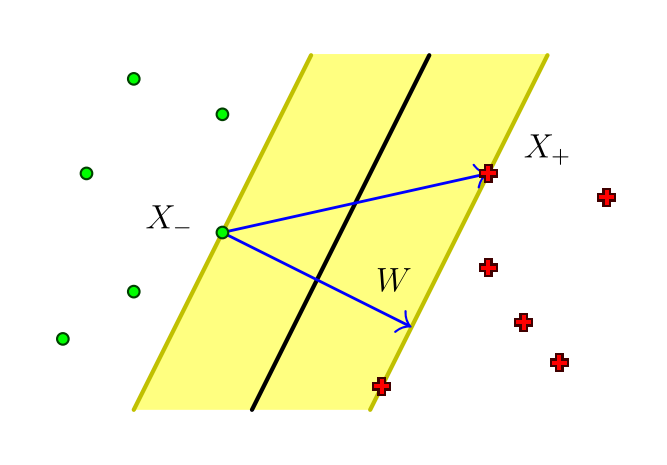
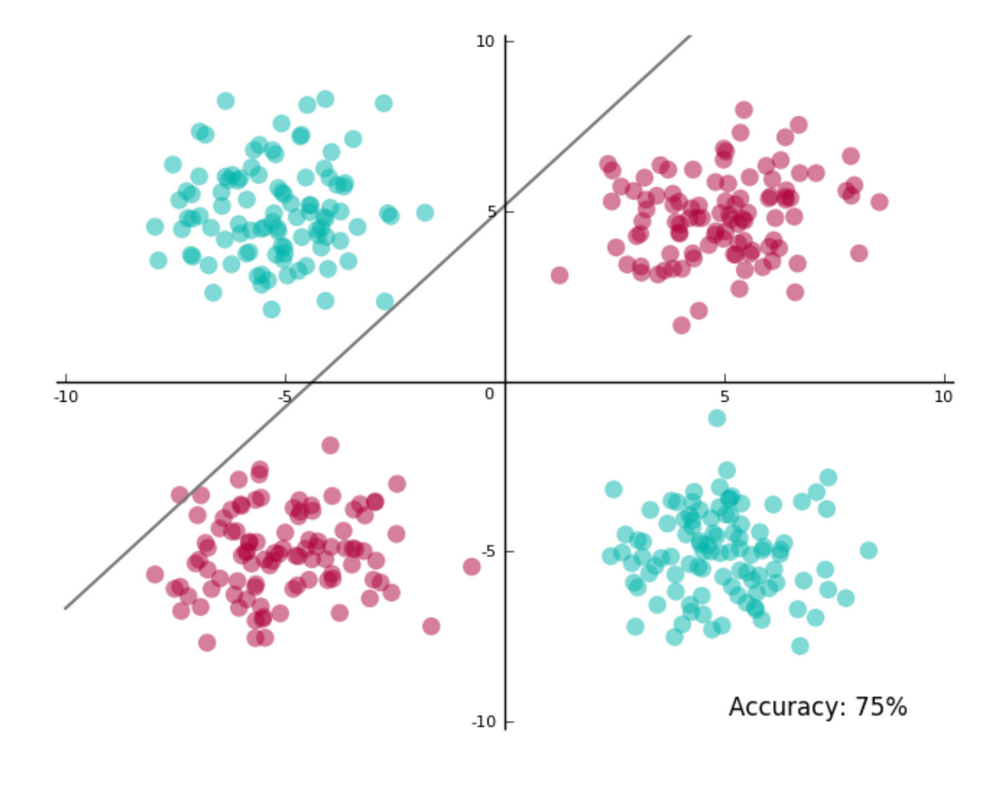

# Метод опорных методов

- [Метод опорных методов](#метод-опорных-методов)
  - [Линейно разделимый случай](#линейно-разделимый-случай)
  - [Линейно-неразделимый случай](#линейно-неразделимый-случай)
    - [Ядерный трюк](#ядерный-трюк)
    - [Анализ метода опорных векторов](#анализ-метода-опорных-векторов)
  - [Другие задачи](#другие-задачи)

## Линейно разделимый случай

Идея линейной кассификации: представим себе пространство объектов, которые мы бы хотели бы разделить с помощью некоторой плоскостью (прямой при двумерном случае). Понятное дело, что мы здесь ограничены в построении такой плоскости в методах, хотя можем и построить через градиентный спуск тот же.

Мы рассмотрим *линейно-разделимый случай*, то есть тот, когда мы действительно можем построить плоскость, разделяющая объекты двух классов. Основная идея *методов опорных векторов*: давайте построим эту разделяющую поверхность таким образом, что она будет наиболее удаленной от разных классов. Формально, линейно-разделимая выборка это такая, что у нас существует такие параметры $w$, $w_0$, что значение функции отступа (значение целевого признака (либо -1, либо +1), помноженный на функцию, разделяющая гиперплоскость) всегда будет положительным.

$$
  \exists w, w_0 : M_i(w, w_0) = y_i(\langle w, x_i \rangle - w_0) > 0, \, i = 1, \ldots, |\mathcal{D}|
$$

Давайте попробуем сначала нормализовать величину отступа. Как мы задаём уравнение гиперплоскости? Фактически, это $\langle w, x \rangle = 0$, те, которые будут параллельно нашей плоскости будут иметь уравнения вида: $\langle w, x \rangle - 1 = 0$ и $\langle w, x \rangle + 1 = 0$. Тогда, *уравнение разделяющей полосы*:

$$
  \{x : -1 \leqslant \langle w, x \rangle - w_0 \leqslant 1\}
$$

С одной стороны, мы добиваемся того, чтобы ни один объект не ломал нам уравнение максимального разделения и $M_i \geqslant 1$ всегда. С другой стороны, мы хотим добиться максимальной ширины полосы. Посмотрим на формулу ширины полосы:

$$
  \begin{aligned}
    \dfrac{\langle x_{+} - x_{-}, w\rangle}{\|w\|} &= \dfrac{(\langle x_+, w\rangle - w_0) - (\langle x_-, w\rangle - w_0)}{\|w\|} \\
    &= \dfrac{2}{\|w\|}
  \end{aligned}
$$

Ширина полосы выражается простым способом - $2$ делим на норму вектор параметров. Наконец, задаем задачу оптимизации по максимизации ширины и разделения ширины классов объектов:

$$
  \begin{cases}
    \|w\|^2 \to \text{min}_{w, w_0} \\
    M_i(w, w_0) \geqslant 1, & i = 1, \ldots, |\mathcal{D}|
  \end{cases}
$$

## Линейно-неразделимый случай

Формально, *линейно-неразделимый случай* выражается как: какие бы мы не взяли параметры $w$, $w_0$ не подобрали всегда будет существовать объект в нашей выборке $x_d$, который будет нарушать разделяющую полосу/гиперплоскость, то есть отступ всегда будет меньше нуля.

$$
  \forall w, w_0 ~ \exists x_d : M_d(w, w_0) = y_d(\langle w, x_d\rangle - w_0) < 0
$$

Такой разделительной гиперплоскости не существует. Тем не менее, мы можем попытаться найти такую гиперплоскость, у которой будут наименьшие значения отступов для каждого объекта.

Давайте посмотрим на два предыдущих условия и введем для каждого объекта так называемый релаксационную переменную: $\xi_i \geqslant 0$ - она всегда будет больше нуля и она будет значить насколько большой штраф, за то, что объект не попал в разделимый случай между объектами - может ли этот объект потенциально нарушить нашу гиперплоскость. Предположим, что мы умеем их определять, тогда, давайте смягчим условие: $M_i(w, w_0) \geqslant 1 - \xi_i$ - при штрафе. С другой стороны, такое изменение затронет и первое условие по ширине плоскости: из $\|w\|^2 \to \text{min}$ мы усложняем в $\dfrac{1}{2}\|w\|^2 + C \cdot \sum_{i = 1}^{|\mathcal{D}|}{\xi_i} \to \text{min}_{w, w_0, \xi}$. Соберём все вместе:

$$
  \begin{cases}
    \dfrac{1}{2} \cdot \|w\|^2 + C \cdot \sum_{i = 1}^{|\mathcal{D}|}{\xi_i} \to \text{min} & w, w_0, \xi \\
    M_i(w, w_0) \geqslant 1 - \xi_i & \forall i \\
    \xi_i \geqslant 0 & i = 1, \ldots, |\mathcal{D}|
  \end{cases}
$$

Эквивалентная задача безусловной оптимизации выглядит так:

$$
  \left(\sum_{i = 1}^{|\mathcal{D}|}{(1 - M_i(w, w_0))_{+}}\right) + \dfrac{1}{2C} \cdot \|w\|^{2} \to \min_{w, w_0},
$$

где $(x)_{+} = \max{(0, x)} = \dfrac{(x + |x|)}{2}$. Данная формула является аппроксимацией эмпирического риска и она очень похожа на гребневую регуляризацию. А что такое константа $C$? Это ширина нашей полосы - чем больше, тем уже, но при этом меньше объектов будут нарушать разделение, чем меньше, тем толще, но тогда потенциально будет большое объектов, нарушающих условие.

Напомним, как решаются задачи математического программирования в общем виде. Представим себе следующие входные данные:

$$
  \begin{cases}
    f(x) \to \text{min}_{x}, \\
    g_i(x) \leqslant 0, & i = 1, \ldots, m,\,j = 1, \ldots, k \\
    h_j(x) = 0.
  \end{cases}
$$

Мы хотим минимизировать функцию $f$, причем, у нас есть ограничения вида $g$ и $h$. В общем виде чтобы решить подобную задачу, необходимо построить *Лагранжиан*: $\mathcal{L}(x, \mu, \lambda) = f(x) + \sum_{i = 1}^{m}{\mu_{i}g_{i}(x)} + \sum_{j = 1}^{k}{\lambda_{j}h_{j}(x)}$ и дальше сформулировать условие Каруша-Куна-Таккера - оно и будет необходимым и достаточным условием поиска минимума.

$$
  \dfrac{\mathcal{L}}{\partial{x}}(x^{\star}, \mu, \lambda) = 0 ~
  \begin{cases}
    g_i(x^{\star}) \leqslant 0, & i = 1, \ldots, m \\
    h_j(x^{\star}) = 0, & j = 1, \ldots, k \\
    \mu_i \geqslant 0, & i = 1, \ldots, m \\
    \mu_i g_i(x^{\star}) = 0, & i = 1, \ldots, m
  \end{cases}
$$

В предлагаемых условиях коэффициенты $\mu$ и $\lambda$ - двойственны переменные к ограничениям. Грубо говоря, это просто переменные, которые мы учитываем, когда рассматриваем лагранжиан. Здесь $x^{\star}$ - это то, что мы хотим найти.

Вернемся к нашей задаче и найдем связь с общим случаем и поймем, что $\dfrac{1}{2}\|w\|^2 + C \cdot \sum_{i = 1}^{|\mathcal{D}|}{\xi_i}$ - это та самая функция, которую мы стремимся минимизировать, а вторые два выражения - это фактические условия неравенства.

А теперь распишем Лагранжиан для нашей задачи:

$$
  \mathcal{L}(w, w_0, \xi, \alpha, \beta) = \dfrac{1}{2}\|w\|^2 - \sum_{i = 1}^{|\mathcal{D}|}{\alpha_{i}(M_i(w, w_0) - 1)} - \sum_{j = 1}^{|\mathcal{D}|}{\xi_{j}(\alpha_j + \beta_j - C)},
$$

где $\alpha_i$ - переменные, двойственные для ограничений $M_i \geqslant 1 - \xi_i$, $\beta_i$ - переменные, двойственные для ограничений $\xi_i \geqslant 0$.

Получим условия минимума в задаче опорных векторов:

$$
  \begin{cases}
    \dfrac{\partial{\mathcal{L}}}{\partial{w}} = 0, ~\dfrac{\partial{\mathcal{L}}}{\partial{w_{0}}} = 0, ~ \dfrac{\partial{\mathcal{L}}}{\partial{\xi}} = 0 \\
    \xi_{i} \geqslant 0, ~ \alpha_{i} \geqslant 0, ~ \beta_{i} \geqslant 0, & i = 1, \ldots, |\mathcal{D}| \\
    \alpha_{i} = 0 ~ \text{или} ~ M_i(w, w_0) = 1 - \xi_i, & i = 1, \ldots, |\mathcal{D}| \\
    \beta_i = 0 ~ \text{или} ~ \xi_i = 0, & i = 1, \ldots, |\mathcal{D}|
  \end{cases}
$$

Давайте рассмотрим производные в условии минимума задачи:

- $\dfrac{\partial{\mathcal{L}}}{\partial{w}} = w - \sum_{i = 1}^{|\mathcal{D}|}{\alpha_{i}y_{i}x_{i}}$. Почему так? Наш отступ - $M_i(w, w_0)$ - это $y \cdot (\langle w, x \rangle - w_0)$ - отсюда берём производную. Отсюда, мы можем вынести, что вектор параметров задаётся в виде: $w = \sum_{i = 1}^{|\mathcal{D}|}{\alpha_i y_ix_i}$.
- $\dfrac{\partial{\mathcal{L}}}{\partial{w_0}} = \sum_{i = 1}^{|\mathcal{D}|}{\alpha_i y_i} = 0$.
- $\dfrac{\partial{\mathcal{L}}}{\partial{\xi}} = \alpha_i + \beta_i - C = 0$. Здесь мы получаем, что $\alpha_i + \beta_i = C$.

А теперь рассмотрим случаи при изменении $\alpha$, $\beta$.

1. $\alpha_i = 0$, тогда $\beta_i = C$, то это значит и $\xi_i = 0$, значит $M_i > 1$. Это значит, что объект лежит где-то очень далеко от разделяющей гиперплоскости.
2. $\beta_i = 0$, тогда $\alpha_i = C$, то это значит и $M_i \geqslant 1 - \xi_i$. Потенциально, это объекты нарушители.
3. $\alpha_i \neq 0$, $\beta_i \neq 0$, тогда $\xi_i = 0$ и его отступ $M_i = 1$. Это значит, что объект лежит на границе разделяющей полосы. Такие объекты называют *опорными*.

Фактически все объекты, у которых $\alpha_i \neq 0$ называют **опорными**. Теперь, на основе условий давайте преобразуем оригинальное условие:

$$
  \begin{aligned}
    \mathcal{L}(w, w_0, \xi, \alpha, \beta) &= \dfrac{1}{2}\|w\|^2 - \sum_{i = 1}^{|\mathcal{D}|}{\alpha_{i}(M_i(w, w_0) - 1)} - \underbrace{\sum_{j = 1}^{|\mathcal{D}|}{\xi_{j}(\alpha_j + \beta_j - C)}}_{=0,~\text{т. к. есть условие из производной}: \dfrac{\partial{\mathcal{L}}}{\partial{\xi}} = \alpha_i + \beta_i - C = 0} \\
    &= \dfrac{1}{2}\|w\|^2 - \underbrace{\sum_{i = 1}^{|\mathcal{D}|}{\alpha_i y_i \langle w, x\rangle}}_{= \langle w, w\rangle} + \underbrace{\sum_{i = 1}^{|\mathcal{D}|}{\alpha_i y_i}}_{=0,~\text{т. к. есть условие}} + \sum_{i = 1}^{|\mathcal{D}|}{\mathcal{L}_{i}} \\
    &= \sum_{i = 1}^{|\mathcal{D}|}{\alpha_i} - \dfrac{1}{2}\sum_{i = 1}{\sum_{j = 1}{\alpha_i\alpha_j y_iy_j\langle x_i,x_j\rangle}}
  \end{aligned}
$$

У нас остаётся одна неизвестная переменная - это $\alpha$. Помним также, что у нас есть дополнительные условия: каждый $a_i$ должен быть не меньше $0$ и не больше $C$ и соблюдается $\sum_{i = 1}^{l}{a_iy_i} = 0$.

Решение задачи может быть выражено следующим образом:

$$
  \begin{cases}
    w = \sum_{i = 1}^{|\mathcal{D}|}{\alpha_i y_ix_i}, & \forall i: \alpha_i > 0, M_i = 1\\
    w_0 = \langle w, x_i\rangle - y_i, & \forall i: \alpha_i > 0, M_i = 1
  \end{cases}
$$

Опять же - мы выразили $w$ и $w_0$ через неизвестные $\alpha$ - остаётся их найти. Их можно искать разными способами. Фактически, у нас появляется такая же задача - задача квадратичного программирования, - и решение на самом деле лежит в пересечении $l$-мерного куба с ребром $C$ и гиперплоскостью $\alpha \cdot y = 0$. Популярный - *Sequential Minimal Optimization*.

Наконец, общий вид линейного классификатора, учитывая, что мы умеем считать $\alpha$-значения, для нашей задачи теперь выглядит так:

$$
  a(x) = \text{sign}\left(\sum_{i = 1}^{|\mathcal{D}|}{\alpha_i y_i\langle x_i, x\rangle - w_0}\right)
$$

### Ядерный трюк

Ещё один метод преобразования линейно неразделимого случая в линейно разделимый. Представим себе такой случай с разделением двух классов - здесь как бы мы не пытались провести разделяющую полосу, все равно не сможем поделить нормально:

Идея *ядерного трюка*: попробуем найти неявное отображение в пространство большей размерности такое, что точки в этом новом пространстве будут линейно-разделимыми. Давайте сделаем некоторую подмену в признаках объектов с помощью ядерной функции. Основная проблема - найти ядро, которое переводит исходное пространство в линейно разделимое.

Функция $K : X \times X \to \mathbb{R}$ является **функцией ядра**, если её можно представить в таком виде: $K(x, x') = \langle\psi(x),\psi(x')\rangle$, где $\psi$ это отображение $X \to H$, где $H$ - это [гильбертовое пространство](https://ru.wikipedia.org/wiki/%D0%93%D0%B8%D0%BB%D1%8C%D0%B1%D0%B5%D1%80%D1%82%D0%BE%D0%B2%D0%BE_%D0%BF%D1%80%D0%BE%D1%81%D1%82%D1%80%D0%B0%D0%BD%D1%81%D1%82%D0%B2%D0%BE) с скалярном произведением.

**Теорема** (необходимое условие). Функция $K(x, x')$ - ядерная функция, если она:

- симметричная: $K(x, x') = K(x', x)$,
- неотрицательно определена на $\mathbb{R}$, для любой функции $g : X \to \mathbb{R}$:

  $$
    \int_{X}{\int_{X}{\left(K(x, x') \cdot g(x) \cdot g(x')\,\partial{x}\partial{x'}\right)}} \geqslant 0
  $$

Ядра можно синтезировать. Константа также является ядром по сути. Самих ядер существует великое множество.

### Анализ метода опорных векторов

Преимущество:

- Задача выпуклого квадратичного программирования имеет единственное решение.
- Любая разделяющая поверхность.
- Небольшое количество опорных объектов, используемых для обучения.

Недостатки:

- Чувствителен к шуму.
- Нет общих правил выбора функций ядра.
- Константу $C$ требуется выбирать.
- Нет возможности выбора признаков.

## Другие задачи

Здесь представлены некоторые другие задачи, которые решаются похожим способом как и SVM.

Имеется дополнительный регуляризатор **LASSO SVM** - добавляет дополнительный параметр регуляризации: $\mu\sum_{i = 1}^{|\mathcal{D}|}{|w_i|}$. Ещё одна функции штрафа **вектор релевантности**: $\dfrac{1}{2}\sum_{i = 1}^{|\mathcal{D}|}{\left(\ln{\lambda_i} + \dfrac{\alpha_i^2}{\lambda_i}\right)}$.

**Машина опорных признаков** (**Support feature machine**) - здесь мы можем задавать параметры селективности и также использовать его для выбора признаков: $\sum_{i = 1}^{|\mathcal{D}|}{R_\mu(w_i)}$, где $\mu$ - параметр селективности, $R_\mu = \begin{cases} 2\mu|w_i|, & |w_i| < \mu \\ \mu^2 + w_i^2 \end{cases}$.

От машины опорных признаков выходит ещё один метод **Support Vector Regression** (**SVR**) - вместо $M$ (функция margin) мы вводим другую функцию ошибок. Наш отступ будет не единичным, а строить функцию в окне $\pm\varepsilon$ и смотреть на то, как значения попадают в наше окно.
