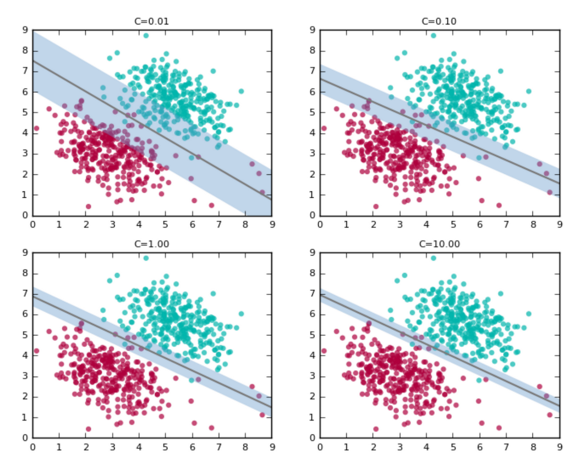

# Метод опорных методов

- [Метод опорных методов](#метод-опорных-методов)
  - [Линейно разделимый случай](#линейно-разделимый-случай)
  - [Линейно-неразделимый случай](#линейно-неразделимый-случай)

## Линейно разделимый случай

Идея линейной кассификации: представим себе пространство объектов, которые мы бы хотели бы разделить с помощью некоторой плоскостью (прямой при двумерном случае). Понятное дело, что мы здесь ограничены в построении такой плоскости в методах, хотя можем и построить через градиентный спуск тот же.

Мы рассмотрим *линейно-разделимый случай*, то есть тот, когда мы действительно можем построить плоскость, разделяющая объекты двух классов. Основная идея *методов опорных векторов*: давайте построим эту разделяющую поверхность таким образом, что она будет наиболее удаленной от разных классов. Формально, линейно-разделимая выборка это такая, что у нас существует такие параметры $w$, $w_0$, что значение функции отступа (значение целевого признака (либо -1, либо +1), помноженный на функцию, разделяющая гиперплоскость) всегда будет положительным.

$$
  \exists w, w_0 : M_i(w, w_0) = y_i(\langle w, x_i \rangle - w_0) > 0, \, i = 1, \ldots, |\mathcal{D}|
$$

[!Линейно-разделимый случай](assets/line.png)

Давайте попробуем сначала нормализовать величину отступа. Как мы задаём уравнение гиперплоскости? Фактически, это $\langle w, x \rangle = 0$, те, которые будут параллельно нашей плоскости будут иметь уравнения вида: $\langle w, x \rangle - 1 = 0$ и $\langle w, x \rangle + 1 = 0$. Тогда, *уравнение разделяющей полосы*:

$$
  \{x : -1 \leqslant \langle w, x \rangle - w_0 \leqslant 1\}
$$

С одной стороны, мы добиваемся того, чтобы ни один объект не ломал нам уравнение максимального разделения и $M_i \geqslant 1$ всегда. С другой стороны, мы хотим добиться максимальной ширины полосы. Посмотрим на формулу ширины полосы:

$$
  \begin{aligned}
    \dfrac{\langle x_{+} - x_{-}, w\rangle}{\|w\|} &= \dfrac{(\langle x_+, w\rangle - w_0) - (\langle x_-, w\rangle - w_0)}{\|w\|} \\
    &= \dfrac{2}{\|w\|}
  \end{aligned}
$$

Ширина полосы выражается простым способом - $2$ делим на норму вектор параметров. Наконец, задаем задачу оптимизации по максимизации ширины и разделения ширины классов объектов:

$$
  \begin{cases}
    \|w\|^2 \to \text{min}_{w, w_0} \\
    M_i(w, w_0) \geqslant 1, & i = 1, \ldots, |\mathcal{D}|
  \end{cases}
$$

## Линейно-неразделимый случай

Формально, *линейно-неразделимый случай* выражается как: какие бы мы не взяли параметры $w$, $w_0$ не подобрали всегда будет существовать объект в нашей выборке $x_d$, который будет нарушать разделяющую полосу/гиперплоскость, то есть отступ всегда будет меньше нуля.

$$
  \forall w, w_0 ~ \exists x_d : M_d(w, w_0) = y_d(\langle w, x_d\rangle - w_0) < 0
$$

Такой разделительной гиперплоскости не существует. Тем не менее, мы можем попытаться найти такую гиперплоскость, у которой будут наименьшие значения отступов для каждого объекта.

Давайте посмотрим на два предыдущих условия и введем для каждого объекта так называемый релаксационную переменную: $\xi_i \geqslant 0$ - она всегда будет больше нуля и она будет значить насколько большой штраф, за то, что объект не попал в разделимый случай между объектами - может ли этот объект потенциально нарушить нашу гиперплоскость. Предположим, что мы умеем их определять, тогда, давайте смягчим условие: $M_i(w, w_0) \geqslant 1 - \xi_i$ - при штрафе. С другой стороны, такое изменение затронет и первое условие по ширине плоскости: из $\|w\|^2 \to \text{min}$ мы усложняем в $\dfrac{1}{2}\|w\|^2 + C \cdot \sum_{i = 1}^{|\mathcal{D}|}{\xi_i} \to \text{min}_{w, w_0, \xi}$. Соберём все вместе:

$$
  \begin{cases}
    \dfrac{1}{2} \cdot \|w\|^2 + C \cdot \sum_{i = 1}^{|\mathcal{D}|}{\xi_i} \to \text{min} & w, w_0, \xi \\
    M_i(w, w_0) \geqslant 1 - \xi_i & \forall i \\
    \xi_i \geqslant 0 & i = 1, \ldots, |\mathcal{D}|
  \end{cases}
$$

Эквивалентная задача безусловной оптимизации выглядит так:

$$
  \left(\sum_{i = 1}^{|\mathcal{D}|}{(1 - M_i(w, w_0))_{+}}\right) + \dfrac{1}{2C} \cdot \|w\|^{2} \to \min_{w, w_0},
$$

где $(x)_{+} = \max{(0, x)} = \dfrac{(x + |x|)}{2}$. Данная формула является аппроксимацией эмпирического риска и она очень похожа на гребневую регуляризацию. А что такое константа $C$? Это ширина нашей полосы - чем больше, тем уже, но при этом меньше объектов будут нарушать разделение, чем меньше, тем толще, но тогда потенциально будет большое объектов, нарушающих условие.

