# Глубокое обучение
## Послойные архитектуры
### Разделяющая способность классификации
Рассмотрим линейную классификацию на двух признаках $sign(\lang x, \theta \rang + \theta_0)$, третий признак -- класс. Здесь у нас задача разделения на 2 класса точек, которые были получены из функции, которую можно задать как логическое или или исключающее или. 
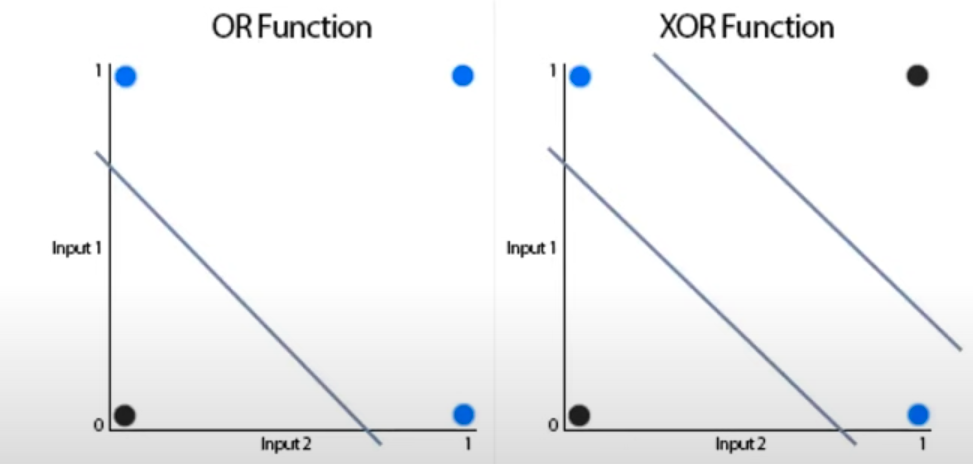
Оказывается, что не все такие функции можно линейно аппроксемировать, есть функция XOR,с которой сделать это не получиться. Просто брать и использовать линейную регрессию неполучиться. Даже простые логические функции могут не быть линейно разделимы. 
Признаки в теории можно не трогать, а можно усложнять функцию. То есть функцию $\text{sign}(\lang x, \theta \rang + \theta_0$ можно представить как знак скалярного произведения и проверить с какой стороны от гиперплоскости расположена точка.

**Не стоит путать линеность с линейностью из дискретной математики. Здесь речь идет про линейную аппроксимацию**
### Логические функции
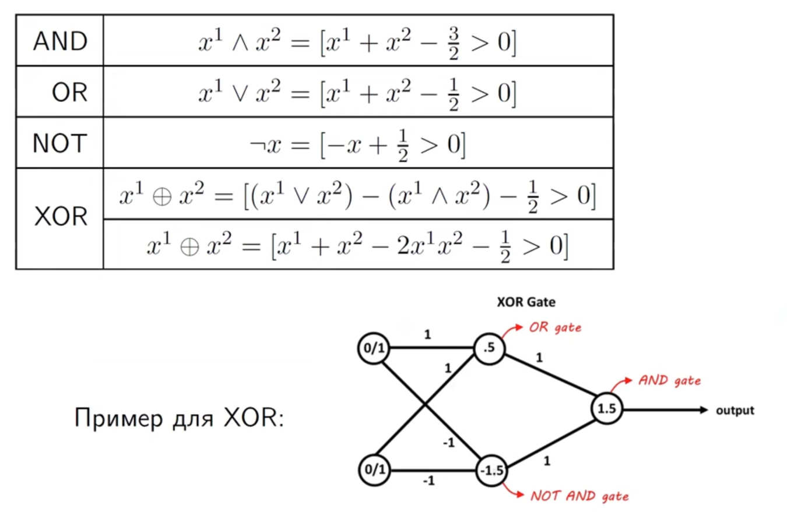
Логическое *и*, логическое *или* и логическое отрицание линейно аппроксимировать можно. А из них мы можем строить другие фукнции. Даже достаточно двух функций. Тем не менее получается, что исключающее или можно построить как комбинацию этих функций. Утверждается, что уже с помощью комбинации линейных классификаторов достаточно, для аппроксимации какой-то произвольной функции. 
Ниже на картинке представлен пример для функции XOR. Стоит учитывать что это только один из возможных примеров, так как логическую функцию мы можем представить еще в виде ДНФ, КНФ и тд. 
### Много слойные сети (DNN, ANN, MLP, FNN)
Хотелось бы что-то похожее что и есть с логическими функциями, но уже для чисел. Проблема заключается в том, что для логический функций у нас были нелинейные функции, которые мы применяли к линейным комбинациям (чтобы функция в итоге получилась сама не линейной (благодаря квадратным скобкам в формулах)), иначе мы бы не смогли аппроксемировать XOR. Для числовых функций идея такая же, посмотрим на картинку:
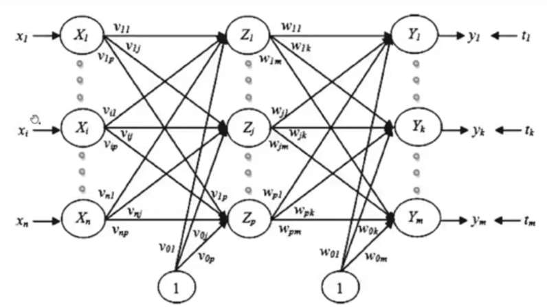.
Для числовых функций идея такая же: давайте брать и применять несколько линейных преобразований подряд, и между ними вставлять несколько нелинейных функций, чтобы вычислительная мощность полученной функции не была эквивалентна обычному линейному преобразованию. Стоит отметить, что на картинке изображено примитивное представление, где каждый элемент функции -- вершина графа, а параметры, на которые умножаются соотвествующие значения написаны на ребрах. В целом для реализации использовать матричный подход:
 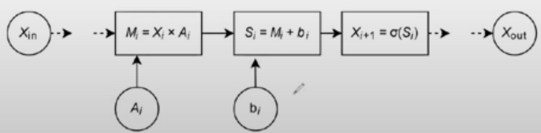
 Приэтом сети не получается, мы просто получаем дерево преобразований. Каждое преобрвазование получает вектор из предыдущего преобразования и какие-то параметры. Также есть представление, где параметры преобразования сидят как бы внутри самого преобразования. При пересчете градиента эти параметры пересчитываются внутри. Тогда получается бамбук. Так проще реализовывать, но градиентный спуск будет сидеть внутри преобразования, и это будет нас ограничивать. Все же лучше делать структуру, где параметры у нас также будут являться входами. 
### Пересчет производной для одного слоя сети
Пусть i-й слой кодирует преобразование векторы длины $n$ в вектор длины $m$.
* $X_i$ -- вход $i$го слоя (вектор длины $n$)
* $Y_i$ -- вызод $i$го слоя (вектор длины $m$)
* Если слой не первый, то $X_i = Y_{i-1}$
* $A_i$, $b_i$ -- параметры слоя: матрица $n \times m$ и вектор длины $m$
* $f$ -- функция активации (для вектора вычисляется покомпонентно)

Тогда $Y_i = f(X_i \times A_i + B_i)$
 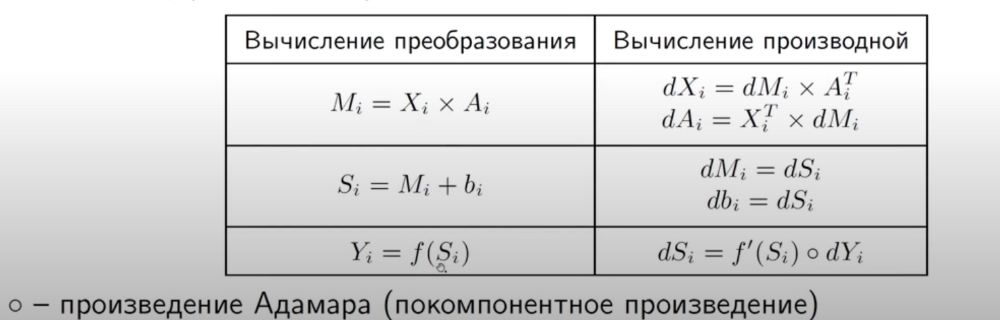
Не все матрицы нужно сохранять при пересчете производной, если, например, для пересчета производной через функцию активации нужно хранить $y$ а не $X$. 

У нас и при вычислении преобразования, и при вычислении производной матричные преобразования, этим можно объяснить что такое преобразование чаще всего используют в качестве обучающего преобразования базовой ячейке в нашем графе. Быстро считается и понятно, какие параметры. 

### Несколько слоев -- это хорошо
* Для логических функций: любую логическую функцию можно представить в виде ДНФ или КНФ. Следовательно, требуется не более двух слоев, но с возможно экспоненциальным числом вершин на промежуточном слое. 
* Для числовых функций: Теорема Цыбенко или Универсальна теорема аппроксимации (1989). Искусственная нейронная сеть с одним скрытым слоем может аппроксимировать любубю непрерывную функцию многих переменных с любой точностью при условии достаточного числа вершин на скрытом слое. 

В любом случае процесс больше похож на интерполяию, чем на аппроксимацию. В реальности используют больше двух слоев!

В реальности никто эту теорему на практике не применяет, потому что никто не пытается сделать преобразование из двух линейных преобразований, с большим промежуточным числом векторов. Вместо этого все просто стараются увеличить число преобразований. 

Нам кажется, что у такого рода преобразования параметров будет больше, чем у линейной регресии, однако в тоерии это не так -- можно сделать 2 преообразования у каждого из которых(насколько понял автор) преобразований будет меньше, чем у линейной регресии.

Однако несколько слоев вызывают также и трудности:
### Несколько слоев это плохо
* Проблема симметрии архитекутыр многослойной нейронной сети: если изменить местами вершины на промежуточном слое, то функция не изменится
* Перестановка может быть непрерывной, следовательно уже для двух слоев функция ошибки содержит множество минимумов.
  

Функция ошибки уже точно будет не выпуклой, и это вызывает несколько проблем.
 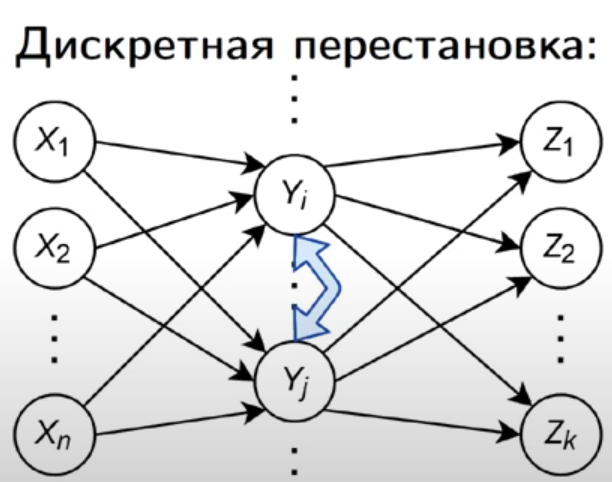
В этом графе каждая вершина это скаляр, а не вектор. В нем можно взять и переставить местами вместе с ребрами какие-то две вершины, получиться то же самое преобразование, но с точки зрения набора параметров это преобразование уже будет другим. Это перестановка параметров по сути существует в нашем пространстве. Также есть непрерывная перестановка:
* $w(u,v)$ -- связь между вершинами $u$ и $v$
* $a\in [0;1]$: при $0 \rightarrow^a 1$ перестановка $Y_i \rightarrow Y_j$
* $\forall 1 \leq u \leq n$ и $1 \leq b \leq k$:
*****
$w_a(X_u, Y_i) = \alpha * w(X_u, Y_i) + (1 - \alpha) * w(X_u, Y_j)$
$w_a(X_u, Y_j) = \alpha * w(X_u, Y_j) + (1 - \alpha) * w(X_u, Y_i)$
$w_a(Y_i, Z_v) = \alpha * w(Y_i, Z_v) + (1 - \alpha) * w(Y_j, Z_v)$
$w_a(Y_j, Z_v) = \alpha * w(Y_j, Z_v) + (1 - \alpha) * w(Y_i, Z_v)$
То есть, если мы наш вес $\alpha$ будем менять от нуля до одного, то мы постепенно придем к дискретной перестановке? Получается, что сколько у перестановок из этих вершин существует, столько и будет эквивалетных функций, получается, что если есть какой-то минимум, то есть и $n!$ этих минимумов, который как то раскиданы на нашем пространстве. 

Между ними мы, конечно, можем как-то переходить, но тут уже никто не гарантирует, что значение функции будет сохраняться, то есть оно может и увеличиваться. Получается, что у нашей функции ошибки куча минимумов, ну и соотвественно получается, что функция уже не выпуклая. Тем не менее мы не унываем и все равно используем градиентный спуск. 

На практике же сталкиваются с другой проблемой: при пересчете градиента у нас значение градиента может как разрастаться, так и убывать:
* Если значение убывает, то это называется **vanishing gradient problem** или проблема затухания градиента: с каждым слоем градиент затухает. Чем дальше блок от выхода, тем хуже он обучается. 
* Проблема <взрыва> (разрастания градиента): с каждым слоем градиент может неограниченно расти. Иногда возникает, если в данных присутсвует выброс. При обновлении вектор параметров может быть испорчен. 
  
##### Решение:
* Использование специальных преобразование (LSTM) или функции активации (ReLU)
* Использование предобработки данных или специальной инициализации параметров (например Xavier или He)
* Подрезка градиента: 
* * Глобальная: $||g|| > c\Rightarrow g_{new}= c * \frac{g_{old}}{||g||}$
* * Локальная : $|g_i| > c\Rightarrow g_{i}= c * sign(g_i)$

Подрезка -- более универсальный способ, мы смотрим на координату, и если он превышает какой-то порог, то мы подрезаем ее. Или же глобально просто смотрим на длину вектора градиента, мы весь вектор градиента нормируем. Притом можно использовать подход, когда смотрят не на значение, а на знак. Мы всегда говорим, что при пересчете эти функции можно применять как между преобразованиями, так и в конце когда мы получаем уже вектор градиентов. Также есть вариант, где мы убираем константу и просто смотрим на знак градиента. Комбинировать можно по разному. 

##### Рассмотрим пример:
* Рассмотрим глубокую сеть с d слоями
* Функция активации: $\sigma(x) = \frac{1}{1 + e^{-x}}$
 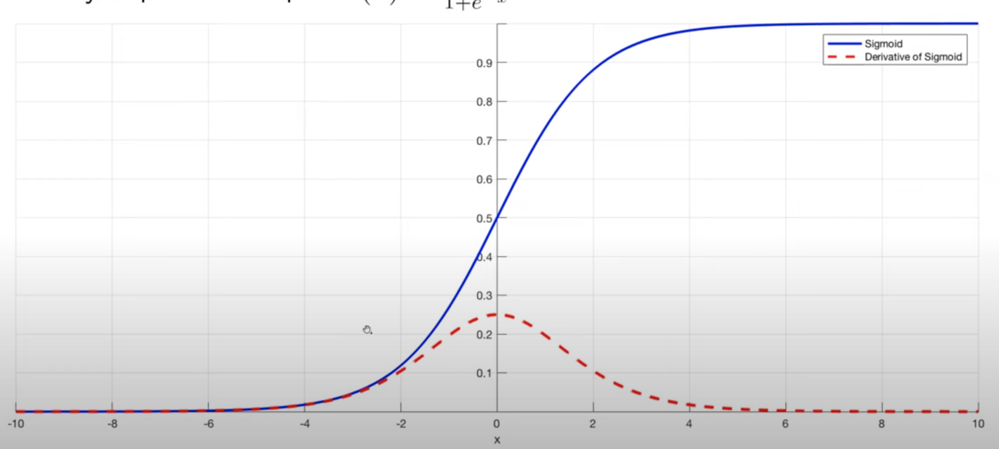
 Видно, что максимум достигается в точки 0, и здесь, максимум производной это всего 2.5, что не очень хорошо, ведь если проследить за тем, как меняестя радиент при пересчете между преобразованиями, то получиться, что мы эту четверть, возводим в какую-то степень, то есть получиться, что градиент убывает, если же менять какие-то параметры, то получиться число больше единицы, и градиент будет расти экспоненциально. Трудно подобрать это число. 
 ### А нужны ли слои
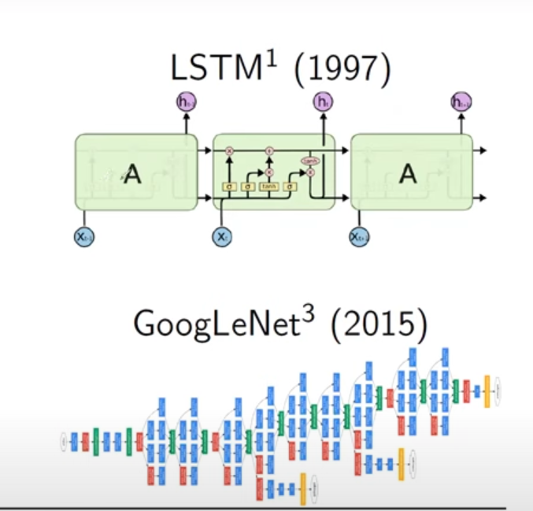
 В архитектуре LSTM идея состоит в том, что при преобразовании, у нас не все преобразования проходят через функции активации. То есть какой-то вектор будет проходить через эти функции, а какой-то нет. Получиться, что как будто бы, если мы считаем что если функции активации виноваты в затухании градиента, то тот будет меньше затухать. 

 Другая идея -- предложена в статье Лекуна, в ней предлагается брать функцию активации,к которой применяют какую-то гипербалическую функцию: $f(x) = tanh(x) + ax$ идея так то похожая, если посмотреть издалека. 

 GoogLeNet -- идея более современная, в ней предлагается брать не послойно, а ациклический граф. Здесь идея состоит в том, что у нашей модели есть несколько выходов, есть выход из последних преобразований, есть из середины графа, и есть где-то изначально выход модели. Соотвественно сделано, чтобы при пересчете градиента, если он будет затухать мы будем пересчитывать его не каждый раз, а так сказать на тех вершинах, у которых он есть. То есть если он будет затухать, мы будем его пересчитывать, и он затухать перестанет. В целом, даже если рассматривать послойные архитектуры, то там считается, что у нас в начале обучается самое последнее преобразование, а в конце первое. В каждом блоке тажке можно делать свою регуляризацию. 
 
 Также есть еще одно популярное преобразование, называется res-net:
 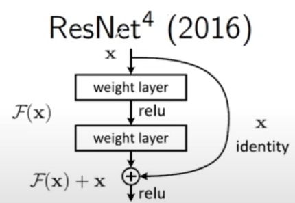
Здесь идея совсем простая: давайте на вход преобразования подставлять предыдущий вектор (после предыдущего преобразования) и соотвественно выход из предыдущего преобразования. То есть как будто мы подставляем выход с предыдущего преобразования и пред предыдущего∂ преобразования. Польза: теперь при пересчете градиента, мы можем взять и перекинуть его обратно на предпредыдущее преобразование. Понятно, что у нас также градиент будет пересчитываться через предыдущее преобразование. В общем получается, что если градиент затухает при пересчете, то получается что это не так страшно, потому что мы возьмем градиент с предыдущего слоя и к нему будем что-то затухающее прибавлять. Соотвественно сам по себе градиент затухать уже не будет. И эта идея продолжается на протяжении всей цепочки преобразований, их там может быть под 90. Это идея простая, но прорываная. Если каждый раз мы будем делать такой обходной путь, то получиться, что мы как будто бы взяли градиент от самого последнего преобразования. Также мы к градиенту еще что-то пребовляем, так называемую identity (насколько я понял это как раз таки и есть ветктор на пред предыдущем преобразовании). 

Так как мы должны прибавлять вектора на пред предыдущем преобразовании, мы сталкиваемся с проблемой размерности: чтобы их сложныть размерность у них должна быть одинаковой. Если мы такие преобразования используем, мы никак не сможем избавиться от изменения разерности векторов. 
 
## Функции активации
Функции активации -- просто какие-то не линейные функции, хотя некоторые линейные функции тоже могут считаться функциями активации. Изначально была идея: аппроксемировать ступенчатую функцию, поэтому там использовали сигмоиду, но она не очень хорошо работает, потому что она не сохраняет 0 (в 0 она выдает 0.5), 0 она выдает где то в -бесконечности. То есть возникала проблема: если нам выгодно, чтобы функция выдавала 0, нам надо было ставить параметры близкими к -бесконечности, что не очень хорошо. 0 выгодно выдавать функции на первой стадии получения, потому что есть вектор сдвига, который мы прибавляем после умножения. Соотвественно выгодно, чтобы после умножения получался 0, прибавлялся к нему вектор сдивга, и мы получаем поведение, похожее на обучение константы, потому что константу проще всего обучить. Получается на первых итерациях (а может даже эпохах) функция как будто бы обучается константе. А из-за этого получается, что предыдущему слою, когда надо выдавать 0, чтобы ему выдавать 0 у него параметры должны быть такими, чтобы делать -бесконечным ввод сигмоидальной функции. В свою очередь получается, что когда все таки функция чему-то обучается, то ей это трудно сделать, так как параметры сидят в -бесконечности, где у нас производная близка к нулю. Когда у нас функция не сохраняет 0 не очень  хорошо, то есть нужно, чтобы она была симметричной. 
### Tanh
Гиперболический тангенс по сути является перенормированной сигмоидой. 
* Функция активации: $a = tanh(x) = \frac{e^x - e^{-x}}{e^x + e^{-x}}$
* Градиент относительно входа: 
  $$\frac{\partial a}{\partial x} = 1 - tanh^2(x)$$
* Аналогичесен сигмодиде, но с другим диапозоном входных значений: [-1, + 1]. В 0 он равен 0.
* Более "сильные" градиенты, потому что данные сосредоточены вокруг 0, а не 0.5
* Меньше предвзятости к выходам скрытого слоя, поскольку теперь выходные данные могут быть как положительными, так и отрицательными (с большой вероятностью в конце будет нулевое среднее значение)
### ReLU
Она комбинирует максимум из нуля и x (как будто бы комбинируем 2 линейные функции, получаем не линейную)
* Функция активации 
  $$a = h(x) = max(0, x)$$
* Градиент относительно входа:
  $$\frac{\partial a}{\partial x} = \text{1 если x > 0, иначе 0}$$
* Очень популярен в компьютерном зрении и распознавании речи. 
Производная здесь достаточно просто считается, это либо 0 либо 1 если больше.

Так как производная в некоторых обстоятельствах может быть равна нулю, получается что это может привести к "смерти" нейрона. Ситуация может возникнуть похожая на сигмоиду. Только если там она была чуть больше нуля, то тут это чистый 0, что плохо. Чтобы с этим бороться, можно максимум заменить на софмаксимум. 

##### Приемущества:
* Гораздо быстрее вычисляется
* Меньше проблем с исчезающим или взрывающимся градиентом
* Переживает значения (примерно половина зануляется)
* Без насыщения
##### Недостатки:
* Несимметричная функция
* Формально не дифференцируется в 0
* Большой градиент во время тренировки может привести к "смерти" нейрона. Более высокая скорость обучения смягчает проблему.

### Softplus
Гладкая аппроксимация (softplus):
$$a = h(x) = \ln{(1 + e^x)}$$
Производная выглядит как сигмоида. По сути производная на сколько я понял это softargmax(0, x).
Здесь у нас проблемы с тем, что она медленная: вычисляются экспоненты и логарифмы, чуть дольша работает чем обычная ReLU. Но она дифференцируема в 0, что является несомненным плюсом. 
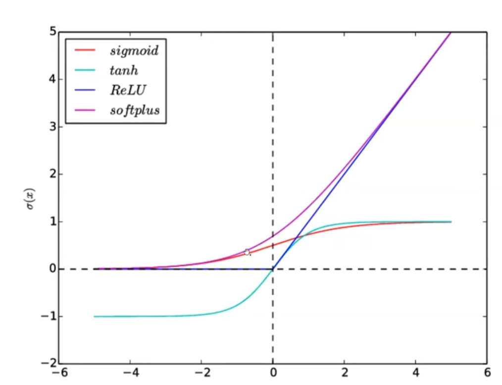
Видно, что сигмоида это тот же самый гиперболический тангенс. Видно что есть softplus, который гладко аппроксемирует ReLu.

### Другие виды ReLU
* Шумный (noisy) ReLU:
  $$h(x) = max(0, x + \epsilon), \epsilon \thicksim N(0, \sigma(x))$$
  Это не совсем параметрический ReLU где параметр случайное число, в теории так сделать можно, но здесь это просто случайное число, которое прибавляется
* ReLU с утечкой (leaky ReLU):
  $$h(x) = \text{x если x > 0, 0.01x иначе}$$
* Параметрический ReLU: ($\beta$ настраиваемый параметр)
  $$h(x) = \text{x, если x > 0, иначе} \beta x$$
Теперь можем посмотреть на графики
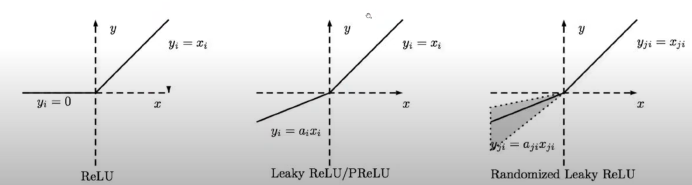
### Другие функции активации:
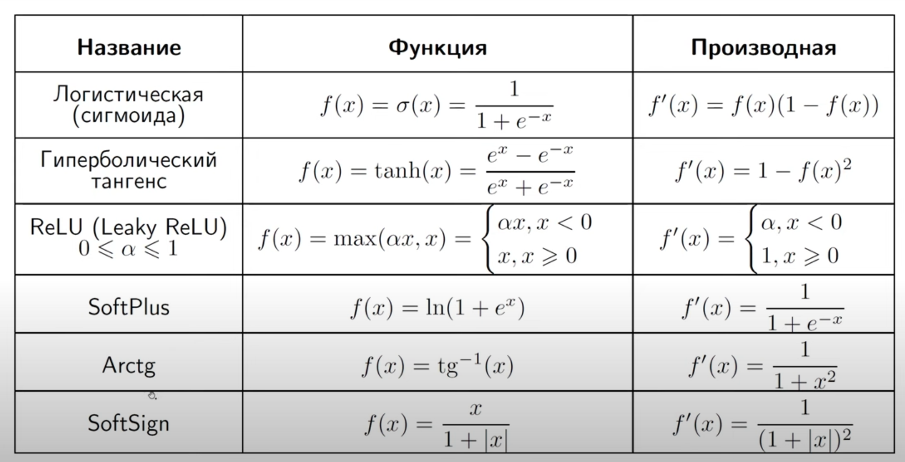
В теории вообще любая нелинейная функция сгодиться, можно даже брать функции ядра из KNN.
### Связь функций активации
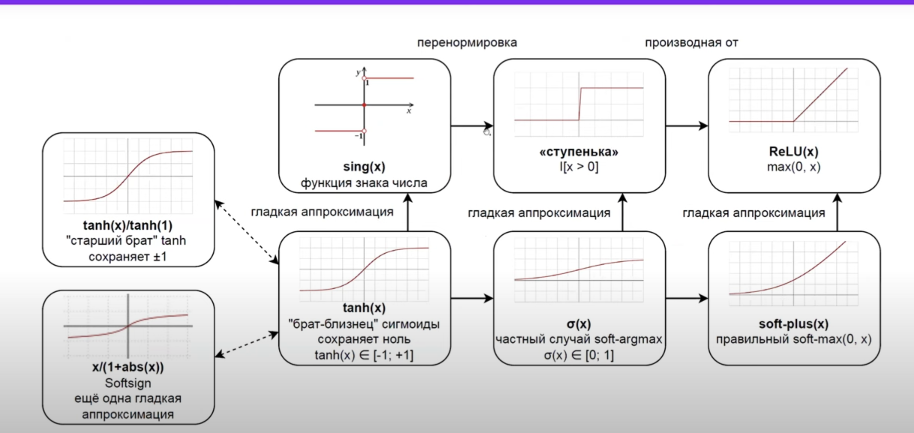
Ступенька это производная от ReLU, в принципе на картинке все написано. 
## Декомпозиция моделей
Наша функция состоит из множества небольших обучаемых преобразований. Мы можем этим пользоваться, например, есть подход перенос знаний:
### Перенос знаний и дообучение
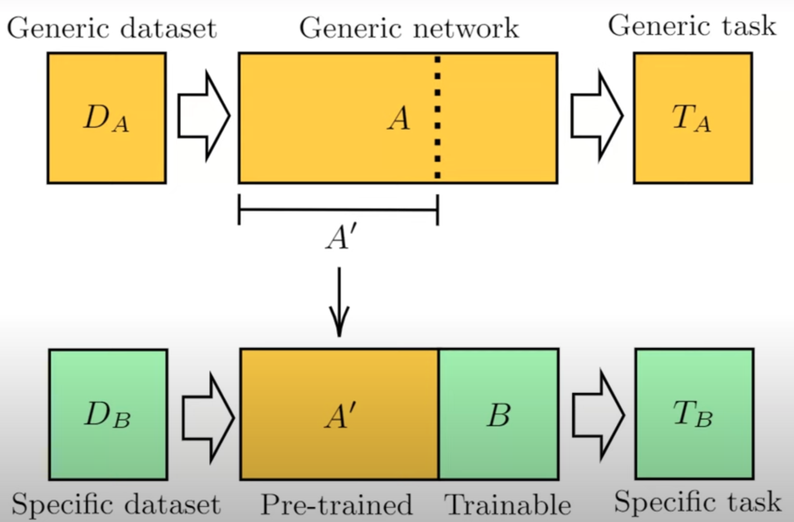
Мы можем взять и разрезать наш граф, который как-то вычисляет нашу функцию, и переиспользовать его кусок. Чаще всего переиспользуют начальную часть графа, это связано с тем, что могут быть разные задачи, у которых похожий вход, для обычных данных (векторных) достаточно редко встречается, но для других задач, где применяются модели глубокого обучения, там встречаются данные уже похожие друг на дружку, например картинки. Соотвественно получается, что у нас есть модель, которой на вход подаются картинки на которых что-то изображено. А может быть другая задача, у которой на вход тоже требуются картинки, то есть и там и там вход у нас картинка, и мы можем переиспользовать модель, которая работает с картинкой. Может быть какая-то задача классификации, которая решалась какой-то большой моделью, на большом числе картинок, а может быть другая задача, для которой не так много картинок, более специфическая. Получается, что у второй задачи будет специфический набор данных, да, на них может быть изображено что-то другое, но нам важно, что сам тип входа это картинка. 
Мы сохраняем нашу уникальную архитектуру, которая на вход получала картинку. Но так как мы решаем другую задачу, оставшуюся часть графа нам надо убрать, это называется голова сети, и подставить туда другую голову, которая бы решала уже нашу задачу. Так как для второй задачи у нас уже поменьше данных, дополняемый кусочек (на картинке B) он может содержать меньше параметров, чем оригинальная функция. Получиться, что мало наборов данных, мы можем позволить себе обучить небольшое число параметров (до переобучения), а нас спасет то, что у нас есть какая-то другая функция, которую мы взяли за основу. 

Здесь важно, что помимо переноса знаний, есть такой подход как дообучение. Он заключается в том, что мы в самом начале замораживаем параметры, переиспользуемого куска функции, потому что преобразование B еще не обучено, и оно градиентами будет только портить параметры преобразования A', мы их замораживаем, обучаем преобразование B, и когда оно уже обучилось, мы можем позволить себе заморозить параметры A' и тоже их немножко дообучить. 
##### дообучение
* В начале обучения пересчет производной через необученные (новые) преобразования будет портить параметры уже обученных (старых) преобразований при обновлении
* Поэтому параметры уже обученных преобразований замораживаются (не обновляются).
* После обучения новых преобразований можно разморозить параметры и дообучить старые преобразования. 

### Прореживание ResNet архитектуры
Примерно такой же подход применяется и при прореживании ResNet подобных архитектур.
Посмотрим на пример такой архитектуры:
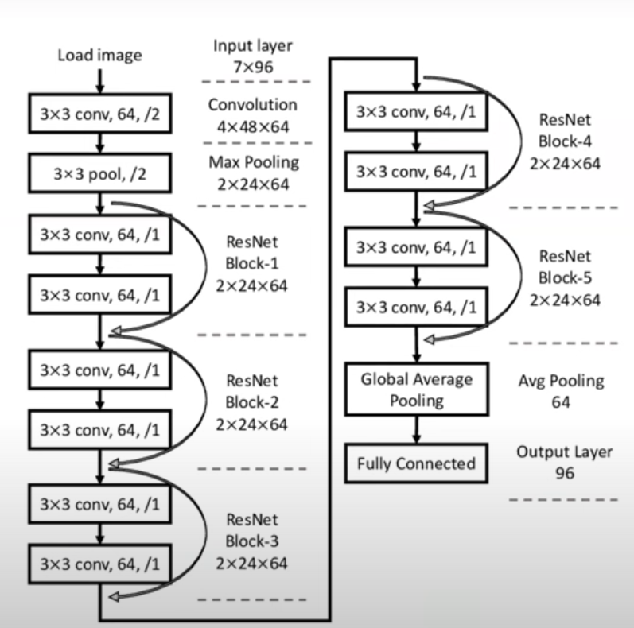
Иза за цепочки преобразований, каждое из которых сумирует свой выход с входом, то получается, что если какое-то преобразование бесполезное, то оно просто может возвращать 0. Так как оно 0 будет суммировать со своим входом, получается, что мы получим тождественную функцию. Здесь достаточно просто получить тождественную функцию, в отличии от обычных архитектур, где мы последовательно их применяем. Получается, что можно следить за такими преобразованиями и смотреть какие из них менее полезны, какие из них возвращают значения близкие к нулю и выкидывать их из наших архитектуры. Изначально мы обучаем какую-то большую архитектуру, а потом постепенно из нее выкидываем ненужное, например, когда на стадии применения мы запускаем архитектуру на каком-то компьютере, с ограниченным числом ресурсов. 
* Каждое преобразование имеет "обходной путь"
* Бесполезные преобразования будут возвращать близкие к нулю значения. 
* Следовательно, можно удалить преобразования, которые возвращают меньшие значения.
* Значения можно оценивать на отдельном (валидационном) наборе данных.
* После удаления преобразований архитектуру требуется дообучить.
### Оптимальное прореживание сетей.
Это подход для более примитивных представлений, когда мы идивидуальные параметры выкидываем, а не все преобразование в целом. Но его достаточно трудно применять, так как требуется смотреть на гессиан:
* Полносвязное преобразование можно представить двудольным графом
* В этом графе можно удалять (прореживать) ребра, которые соотвествуют наиоболее бесполезным параметрам.
* Полезность ребер определяется по формуле: 
$$L_i = \frac{a^2_{i}}{[H^{-1}]_{i, i}}$$
Где $a_i$ -- значение $i$-го параметра, а $H$ -- гессиан (матрица вторых производных)
* Если вторая производная вычисляется долго, то вместое нее можно просто использовать $|a_i|$
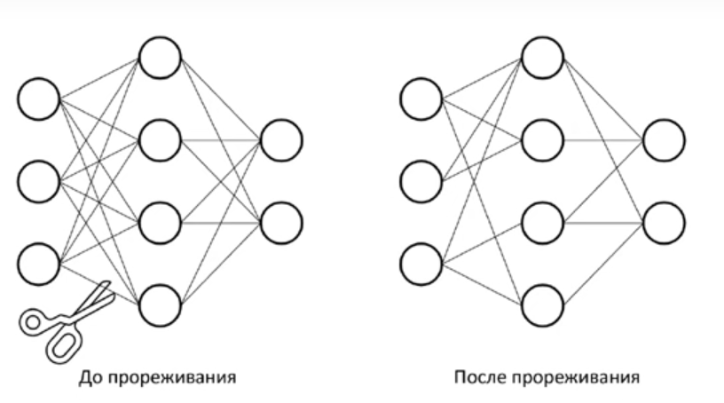
Применять его достаточно трудно, требуется смотреть на диагональ гессиана (обратный) и здесь и такой подход не очень хорошо применяется в прореживаниии, потому что нам нужно сохранять индивидуальные параметры, которые мы выкинули. То есть если  мы хотим сократить потребление памяти, нам нужно выкидывать больше половины параметров, так как если мы выкидываем меньше, нам нужно помнить параметры которые мы выкинули, а это тоже тратить память(иначе такое преобразование вообще не будет иметь смысла)
### Дропаут
Что-то похожее на прореживание, по факту динамическое прореживание. Идея слудющая: будем отключать какие-то куски нашей функции, но динамически. На каждой итерации мы будем брать и занулять выходы из какого-то преобразования, не все, а какие-то определенные. 
* При обучении итерации обнуляем выходы нейронов с некоторой вероятностью (часто до 0.5)
* Обнуленные нейроны не участвуют в обучении, не внося вклад в ошибку
* Для каждого выхода мы фактически строим новую сеть, но у всех этих сетей общие параметры. 
Это можно представить следующим образом: при преобразовании компоненты вектора какого-то преобразования устанавливаем в 0. Берем вектор, заполняем его случайно нулями и единицами и Адомаровым произведением умножаем его на другой вектор, записывая его вместо исходного. 

Зачем?

Такая модификация на практике хорошо работает. Во время такого обучения каждое значение может быть отключено, соотвественно остальные значения не могут на эти значения надеяться и им самим приходиться быть более самостоятельными. С точки зрения математики -- преобразования большие будут менее скорелированы(индивидуальные скалярные вершины в графе). Посмотрим на пример:
 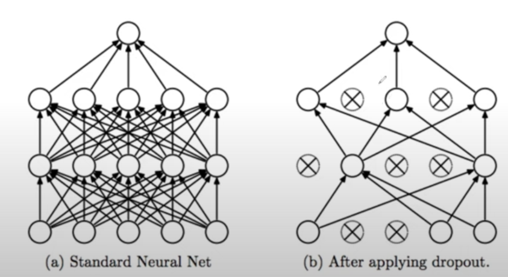
 Получается что у нас есть не единая архитектура, а у нас есть $2^n$ на каждый слой различных архитектур и из этого множества различных архитектур мы на каждом шаге обучения семплирует какую-то одну архитектуру и обучаем. Приэтом все эти архитектуры они делят между собой параметры. 
 
 Важно, что на каждой итерации мы получаем разные значения, и соотвественно на разных слоях отключаются тоже разные нейроны. 

 * Уменьшаяется соадаптация нейронов, потому что они не могут рассчитывать на соседей
 * Обучается более робастное представление
 * Без дропаута сети значительно переобучаются
 * Дропаут приблизительно вдвое увеличивает число операций до сходимости
Надо помнить, что на стадии применения нам ничего не надо отключать, но получиться, что если все ячейки будут включены, то у нас измениться математическое ожидание и их придется перенормировать. Иногда все такие на стадии применения функции используют это отключение.
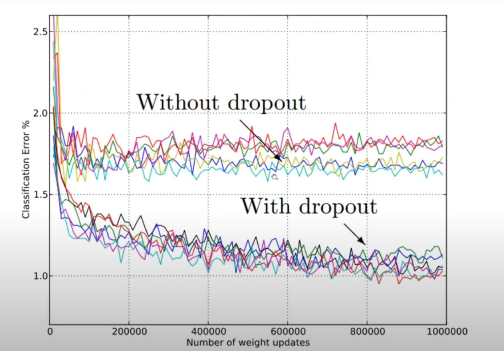
Это график сходимости, как мы видим один и тот же алгоритм (например синий) без дропаута сошелся только до +- 1.75, с дропаутом же дошел до единицы.
### Батчевая нормализация
Другое преобразование, которое часто подсовывают между другими преобразованиями.

Мы можем в теории взять и нормализовать набор данных, и тогда вход модели будет декремирован, будет мат ожадение 0 и дисперсия 1. И мы можем надеяться, что у нас какие-то адекватные параметры получаться. Так мы могли надеяться только на линейной регресии.
Здесь же все не так: у нас множество параметров и контролировать, что происходит на промежуточных векторах мы не можем. Батчевая нормализация -- одная из попыток такого контроля. Нормализовывать данные между промежуточными преобразованиями. Но для нормализации нам нужно статистику набрать. Здесь же предлагается набирать статистику по пакету, поэтому она так и называется.

Мы берем преобразование, оно выдает нам вектор, мы возьмем пакет данных и получим несколько векторов (для одного объекта -- один вектор, для двух -- два) и так далее. Возьмем и по координатам посчитаем статистику по пакету (обычно считается среднее и дисперсия). 
* Когда меняются параметры слоя, также меняются распределения его выходов
* Основная идея: поддерживать константу ковариации для каждого выходного слоя:
$$\hat{x} = \frac{x_d - \mathbb{E[x_d]}}{\sqrt{\mathbb{D}[x_d] + \epsilon}} $$
E и D следует оценивать на каждом батче
$\epsilon$ добавляется чтобы случайно не поделить на 0. Так делается для каждой координаыты. 
В теории можно использовать другое преобразование: смотреть статистику по самому вектору, это уже называется instance normalization. Мы уже смотрим статистику по объекту. Иногда это может быть лучше, потому что получаются странные преобразования, которые зависят от пакета данных. Здесь еще проблема применения модели, так как при применении модели получается, что тоже нужно пакетно обрабатывать данные, ну или надо как-то мат ожидание и диперсии предпосчитать на всем наборе данных, а потом подставить. 
#### Параметрический слой для батчевой(пакетной) нормализации
Работает это примерно так: мы после нормализации делаем еще линейное преобразование, потому что во время нормализации мы могли потерять какую-то линейную взаимосвязь, потому что мы делаем какое-то линейное преобразование. Соотвественно после такое нормализации мы делаем следующее:
$$\hat{y_d} = \gamma_d\hat{x}_d + \beta_d$$
Приэтом параметры $\gamma$ и $\beta$ они обучаемые, так как оценивались при дисперсии на самом пакете данных. То есть это тоже обучаемое преобразование. 
По факту $\beta$ -- центр входа, а $\gamma$ -- стандартное отклонение. 

График сравнения:
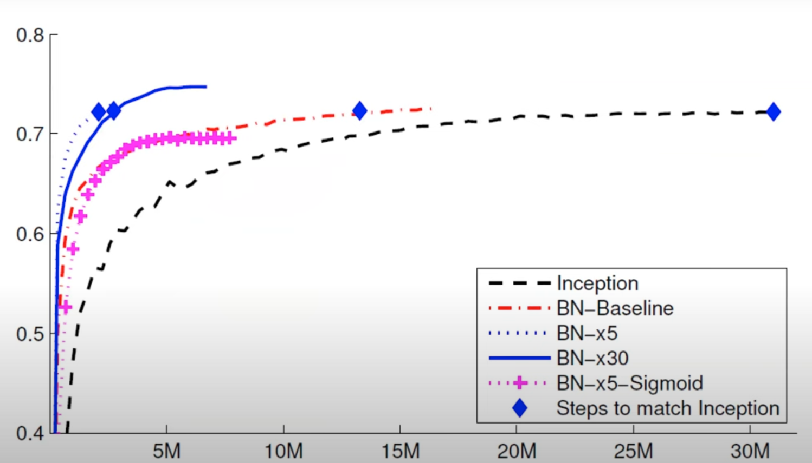
В данном графике вычисляется качество, получается что функция быстрее достигает какой-то отметки, причем она превышает то, что было без батч нормализации.

**Батч нормализация и дропаут плохо вместе работают.**

* работает быстро
* Сходиться быстро
* Делает сторонние регуляризаторы не такими полезными

## Инициализация параметров
### Стандартная инициализация
Вспомним сигмоиду и то, что она зануляет постепенно градиент. В этом частично виноваты параметры. Дак давайте подберем параметры, чтобы при умножении на них они не меняли дисперсию нашего вектора. 
* параметры векторов сдвига можно инииализировать нулями
* Параметры матриц преобразований нельзя инициализировать нулями
* Параметры матриц преобразований нельзя инициализировать одинаковыми значениями.
* Параметры матриц преобразований инициализируются случайными значениями.
### Метод Xavier. Мотивация
* предположим, у нас есть функция активации $f$, линейная вблизи 0:
$$f(x) = x$$
* tanh -- пример такой функции
Основная идея состоит в том, чтобы поставить параметры в такой линейной области и поддерживать постоянство дисперсии внутри "области линейности".
Можно взять и для параметров выписать как они влияют на дисперсию:
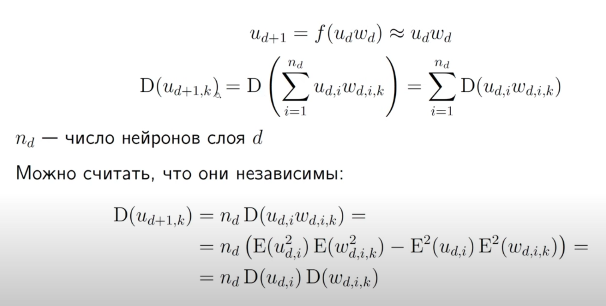
Здесь используется предположение, что все берется из симметричного распределения, у уоторого мат ожидание в нуле. Нужно, чтобы здесь сокращались различные математические ожидания. Важно, чтобы у нас считались величины независимыми.
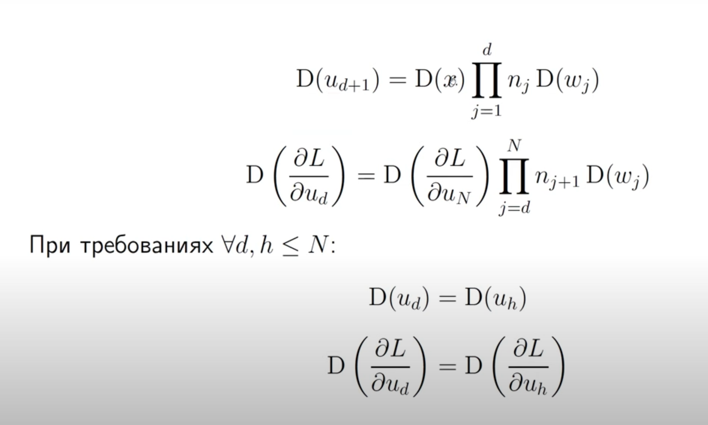
Получается, что дисперсия на $d$ом слое -- дисперсия на входе и произведение дисперсий на размеры слоев на каждом преобразовании(размеры векторов).
Так как мы для пересчета производных делаем то же самое, то соотвественно для производной тоже важно, чтобы сохранялась дисперсия для градиентов. Получается следующее:
 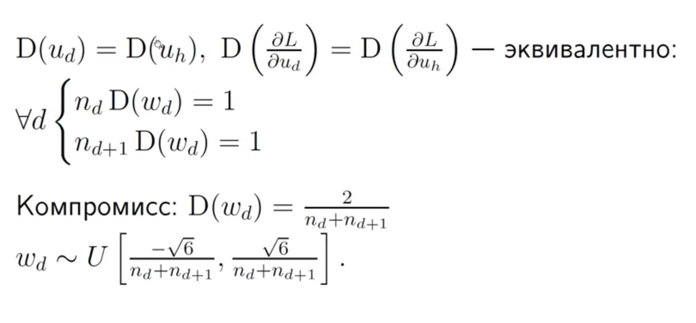

С одной стороны нам хочется сохранять дисперсию для векторов -- с другой дисперсию для градиентов. Такое заполнение называется заполнением по Xavier. Здесь представлен пример для равновероятного распределения, но можно использовать любое симметричное. 

### что делать с ReLU?
ReLU не симметричная функция, соотвественно так с ней мы поступить не сможем, что же делать?
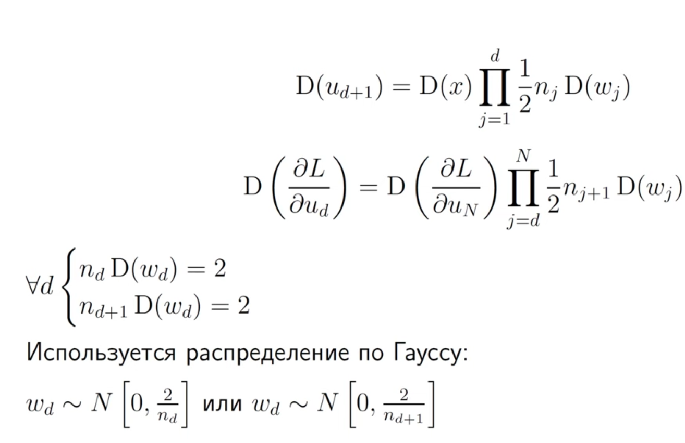
Здесь применяется немного другой подход для пересчета дисперсии. Мы пытаемся не после выхода сохранить дисперсию, а стараемся сохранить дисперсию между слоем, полученным после умножения текущего вектора на матрицу, и между таким же, но предыдущим слоем. Умножение на матрицу даст нам что-то симметричное, поэтому эта идея так же сохраняется. Так как ReLU половину зануляет, а половину сохраняет, дисперсия в половину уменьшается. 
Здесь предлагается сохранять дисперсию для производной, в качестве распределения берется распределение, у которого дисперсия равняется 2 делить на число выходов текущего преобразования. 

**Такое подход называеся He**

Посмотрим на разницу:
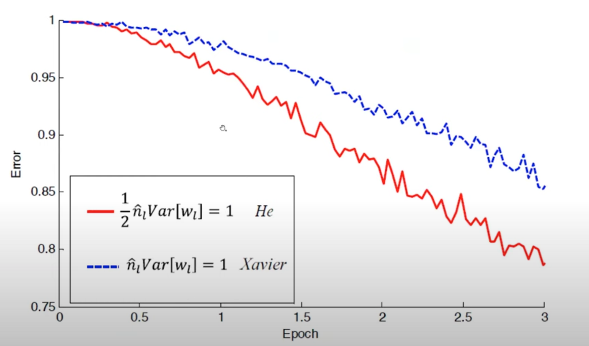
Взяли архитектуру у которой в качестве функции активации используется ReLU из 22-х слоев. Получилось, что парвильное исполнение позволило лучше обучиться. 
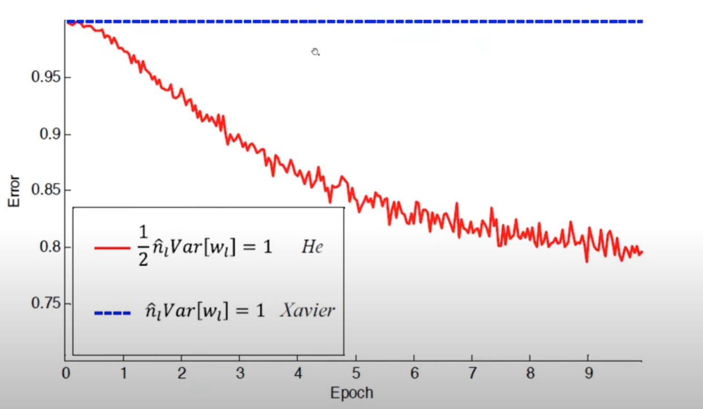
А для 30ти слоев получилось, что правильное заполнение вообще позволило обучиться, а неправильное даже не сдвинулось с места. 