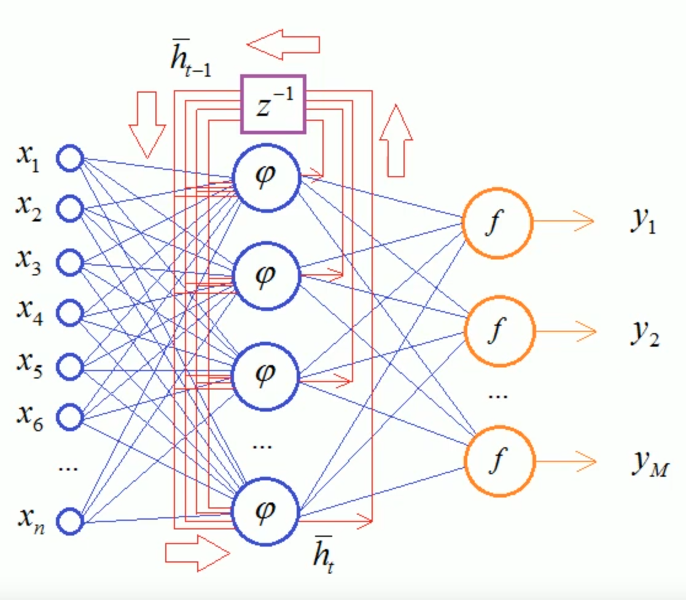
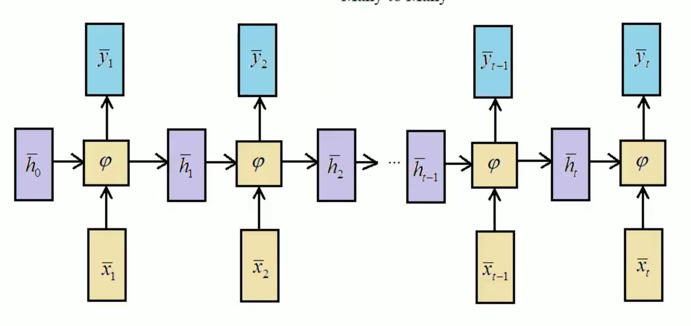
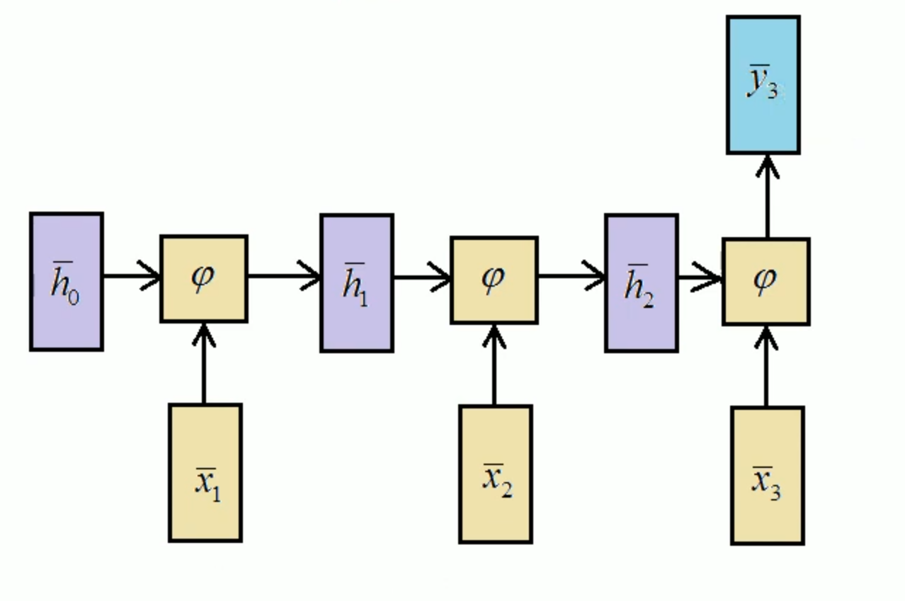
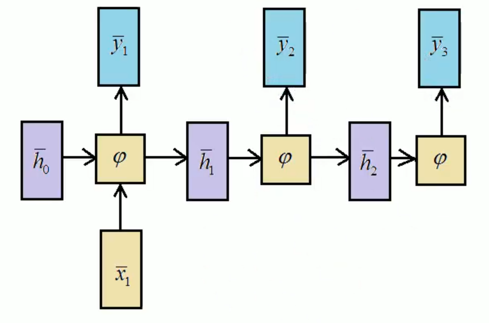

# Рекуррентная нейронная сеть

**Рекуррентная нейронная сеть** - вид нейронных сетей, где связи между элементами образуют направленную последовательность. По сути, это сети с внутренними циклами.

Принцип работы: входные параметры $x$ подаются в рекуррентный скрытый слой $\varphi$, выходы которых снова подаются на их входы с некоторой задержкой $z^{-1}$, где $f$ - функции активации, а $y_1, \ldots, y_M$ - выходные значения. Математический формальный вид:

$$
  \hat{h}_{t} = \varphi{(\hat{h}_{t - 1}, \hat{x}_{t})}, ~ \hat{h}_{0} = [0, 0, \ldots, 0_{n}]^{\mathrm{T}}
$$

Виды RNN при развёртке:

- *Many-to-Many*. Множеству входных векторов соответствует множеству выходных векторов. Используется, например, для перевода текстов.

  

- *Many-to-One*. На вход подаём разные наблюдения, на выходе получаем только одно конкретное значение. Используется, например, для анализа эмоциональной окраски текста.

  

- *One-to-Many*. На вход подаём один вектор, на каждой итерации мы получаем выходные значения. Используется, например, для генерации описания изображений, когда на вход подаются карты признаков изображения, а на выходе получаем его описание.

  

- *One-to-One*. На вход подаём один вектор, на выходе получаем только одно конкретное значение. Используется для выполнения нелинейных рекуррентных вычислений.
