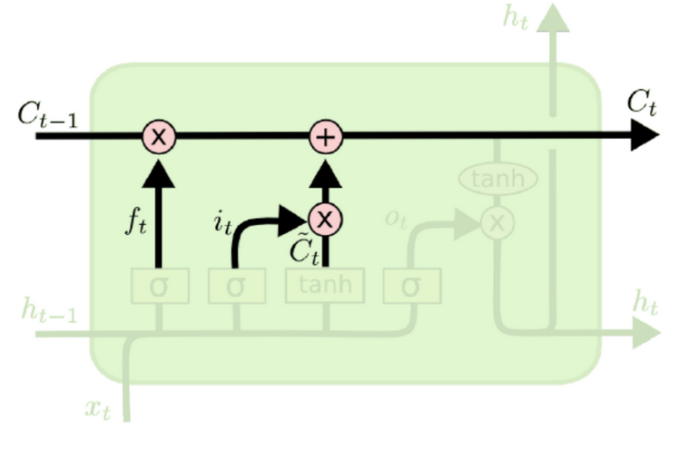
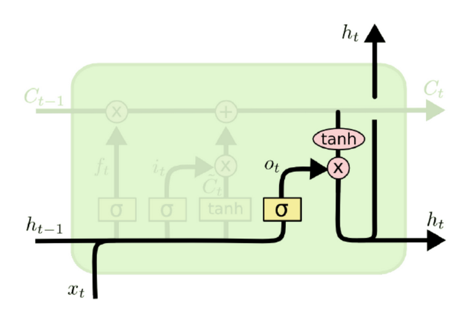

# Модуль памяти в рекуррентных сетях (LSTM)

В чем проблема сетей? В том, что *скрытые* состояния не очень хорошо хранят информацию. Давайте вместо выделим отдельный блок для памяти для этого.

**Долгая краткосрочная память** (или: LSTM) - особая разновидность архитектуры рекуррентных нейронных сетей, способная к обучению долговременным зависимостям. *Блок памяти* используется в LSTM для хранения глобального состояния. Ячейка такой памяти параметрическая.

LSTM состоит из следующих этапов:

- *Лента*. Используется для накопления информации (скрытое состояние).
- *Фильтр забывания*. Определяет, что нужно забыть.

  

- *Фильтр входа*. Определяет, что нужно записать в память.

  

- *Обновление памяти*. После вычислений обновляем хранимое в памяти.

  

- *Обновление скрытого состояния*. Фильтр скрытого состояния определяет, как его изменить.

  

Существует несколько модификаций LSTM:

- *LSTM со смотровыми глазками*. Через смотровые глазки (peephole connections) память используется для обновления себя и скрытого состояния.

  

- *Gated restricted unit*. Можно уменьшить число операций, поменяв операторы и сохранив всё в $h$.

  

Преимущества и недостатки LSTM.

- Могут работать удаленными во времени зависимостями.
- Нет затухания или взрыва градиента.
- LSTM ячейки требуют много времени для обучения.
- LSTM забывают длинные зависимости.
