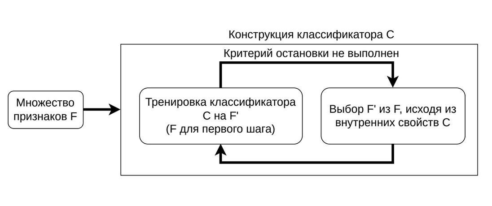
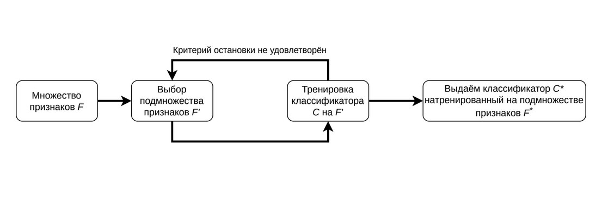
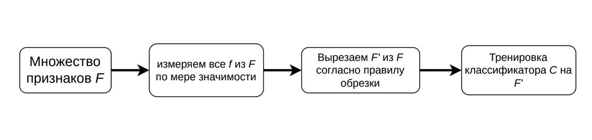

# Уменьшение размерности. Синтез признаков. Выбор признаков. Алгоритмы фильтрации

В задаче **уменьшение размерности** у нас имеется объекты, которые описаны признаками $\mathcal{F} = (f_1, \ldots, f_n)$, по которым мы хотим построить множество признаков $\mathcal{G} = (g_1, \ldots, g_k) : k < n$ (часто новое множество сильно меньше по мощности), переход к которым сопровождается наименьшей потерей информации. В данной задаче, помимо несильного уменьшения точности (допускается небольшое отклонение), мы добиваемся:

- Ускорение обучения и обработки
- Борьба с шумом и мультиколлинеарностью
- Интерпретация и визуализация данных (например, мы смогли свести данные к двумерному или трехмерному случаю)

Есть два основных метода уменьшения размерности: *выбор признаков* и *синтез признаков*. Чем же они отличаются?

- **Выбор признаков** включает признаки $\mathcal{G}$ такие, что $\mathcal{G} \subset \mathcal{F}$. Грубо говоря, признаки выбираются только из $\mathcal{F}$.
- **Извлечение признаков** включает признаки $\mathcal{G}'$ такие, что $\mathcal{G} \subset \mathcal{F}$ и $\exists x \in \mathcal{G}: x \ni \mathcal{F}$. Грубо говоря, признаки могут выбираться из $\mathcal{F}$ и могут быть придуманы алгоритмом.

**Встроенные методы** (выбора признаков) - это методы выбора признаков, при которых этот выбор осуществляется в процессе работы других алгоритмов (классификаторов и регрессоров). Важно, что такие методы очень специфичны для каждого алгоритма, несмотря на то, что у нас есть более менее общий интерфейс оных.

**Методы-обёртки** - это такие методы, которые берут также существующие алгоритмы (но мы никаким образом не знаем про этот алгоритм) и здесь теперь сводим задачу выбора признаков к задаче оптимизации.

Можно сказать, что у нас есть $Q(\mathcal{F}) \to \mathbb{R}$ - функция качества от набора признаков, скажем, что у нас есть бинарный вектор из $0$ и $1$ (либо не берем признак, либо берём) - теперь есть функция $Q$, которая формирует по бинарному вектору какое-то подмножество $\mathcal{F}$, которое подставляется в другую функцию и считает качество.

**Фильтрующие методы** пытаются оценить каждый признак какой-то мерой значимости и после этого отсортировать по данной значимости и выбрать наиболее значимые.

