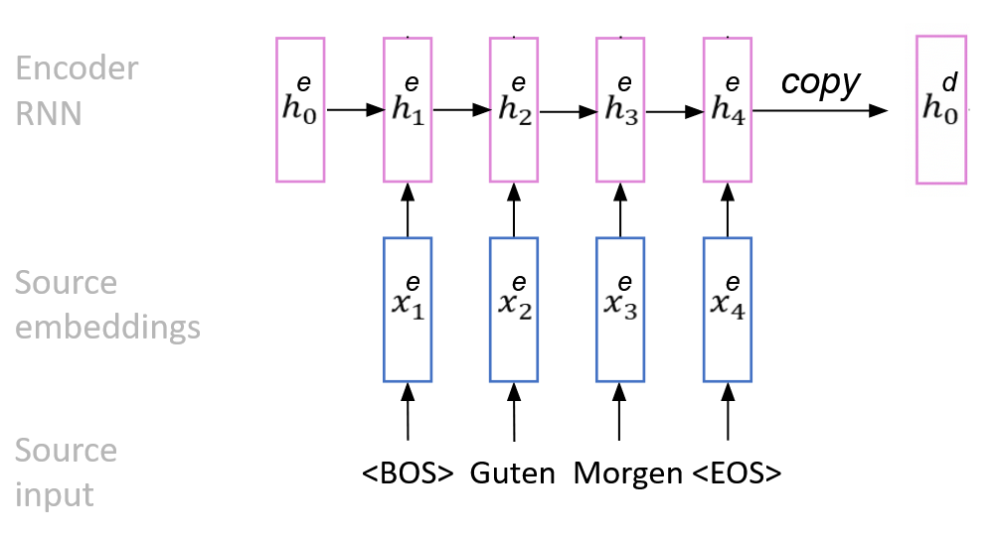
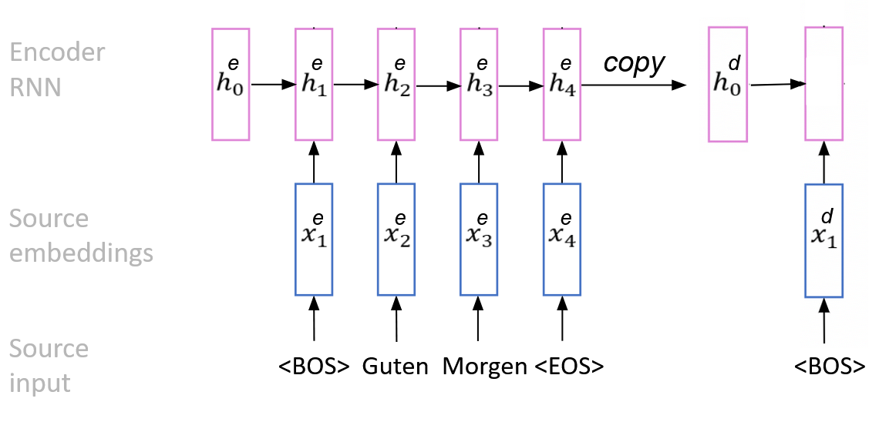
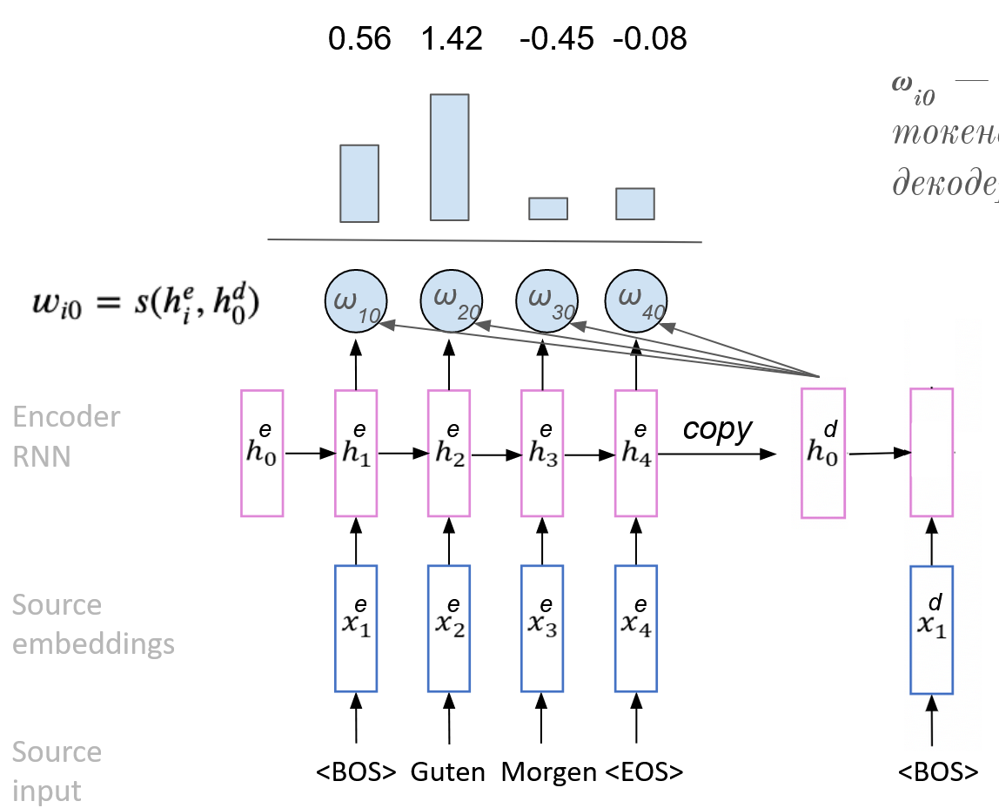
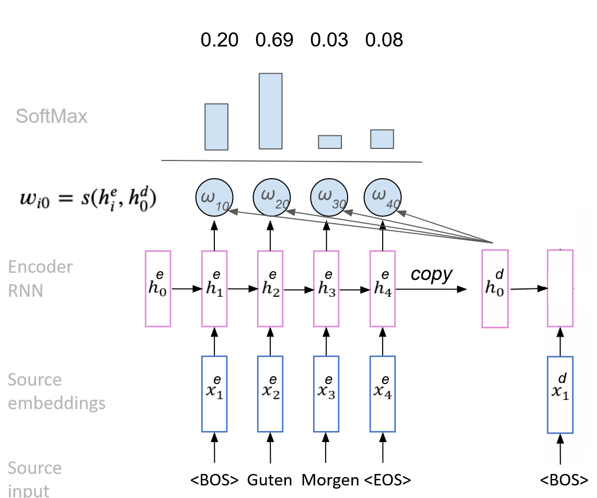
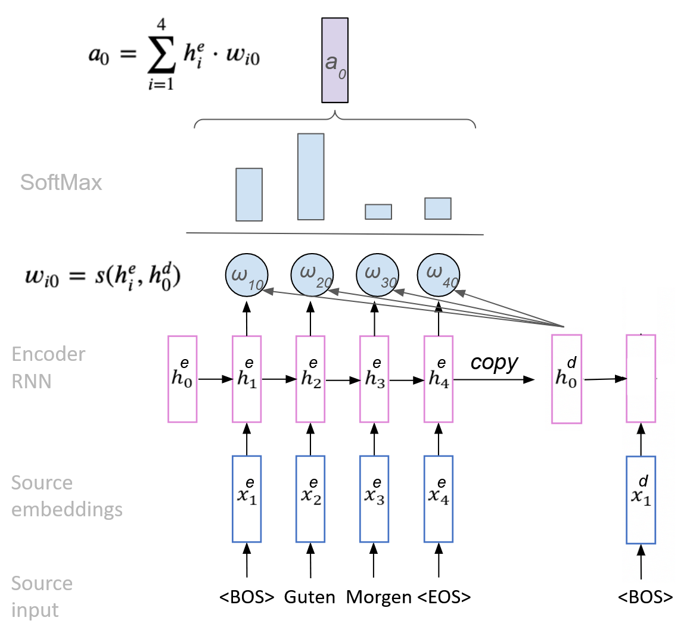
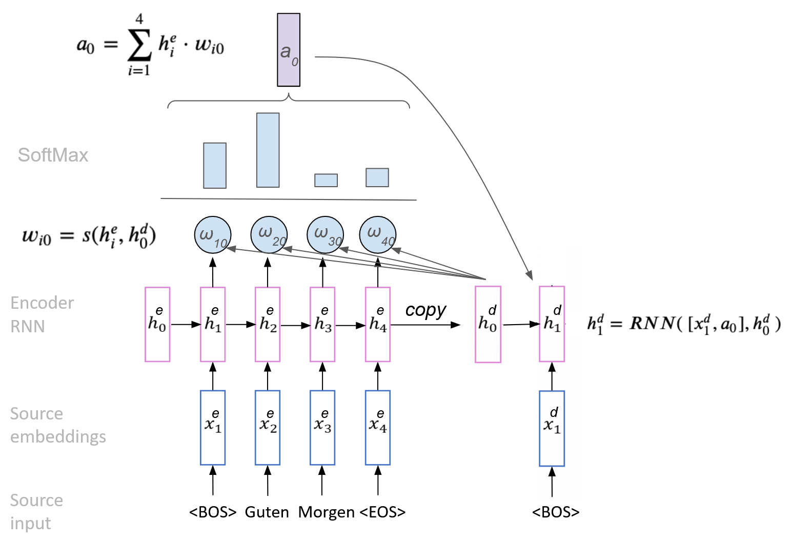
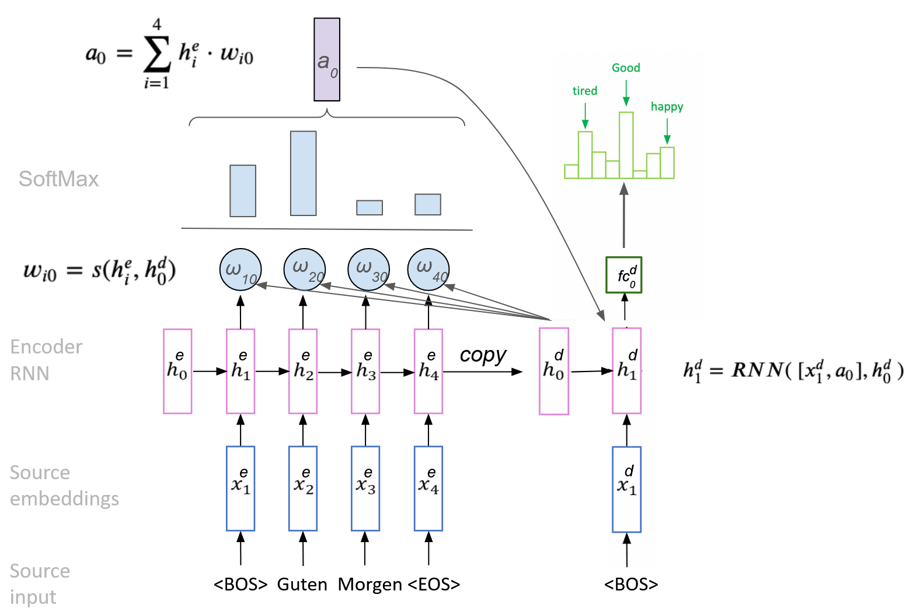
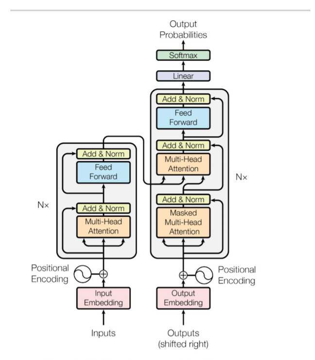

# Механизм внимания в рекуррентных сетях (трансформер)

- [Deep Learning School - Лекция. Механизм внимания (Attention)](https://youtu.be/Fki-Xe3CGg8?feature=shared)
- [Викиконспекты - Трансформеры](https://neerc.ifmo.ru/wiki/index.php?title=%D0%A2%D1%80%D0%B0%D0%BD%D1%81%D1%84%D0%BE%D1%80%D0%BC%D0%B5%D1%80)

## Механизм внимания

Идея **механизма внимания** раскрывается в задаче перевода текста, например, с русского языка на английский, в этом случае мы (люди) во время генерации перевода прошлись бы несколько раз, смотрели бы на разные части исходного предложения, чтобы найти те части, на которые стоит обратить внимание в данный момент времени, и лучше их запомнить. Механизм внимания - это то, что позволит декодеру модели "подглядывать" в нужные части исходного предложения во время генерации.

Схема механизма:

- Encoder RNN будет работать точно так же, как и раньше. Он будет читать предложение и запоминать вектор скрытого состояния.

  

- На вход в Decoder в первый момент времени мы подаём $\text{BOS}$, получаем эмбендинг этого токена и подаём вход рекуррентном слое. Первое значение скрытого слоя в рекуррентном слое $h_{j}^{d}$ (сначала: $j = 0$) будет скопировано из $h_{4}^{e}$.

  

  Перед тем как Decoder будет обновлять своё скрытое состояние, он будет делать это не только на основе $h_{j}^{d}$ и на основе эмбендинга $x_{1}^{d}$, но ещё и на основе той информации, которую он получит, обращая внимание на некоторые части входной последовательности.

    1. Для данного скрытого слоя $h_{j}^{d}$ мы посчитаем $\omega_{i}^{j}$ - это вес (важность) $i$-го входного токена для текущего состояния декодера.

        

    2. Далее мы прогоняем их через функцию $\text{SoftMax}$, чтобы получить вероятности на токены входящего предложения - вероятность, с которой данный токен важна для декодера, чтобы обновить своё скрытое состояние и сгенерировать следующий токен предложения.

        

    3. Перемножаем каждый из значений скрытого состояния элементов encoder'а $h_{1}^{e}$, $h_{2}^{e}$ и так далее на полученный вес после функции $\text{SoftMax}$: $a_{j} = \sum_{i = 1}^{n}{\left(h_{i}^{e} \cdot \omega_{i}^{j}\right)}$ - вектор с информацией, которую мы агрегировали из исходного предложения (скрытых состояний).

        

    4. Далее алгоритм RNN-декодер будет обновлять своё скрытое состояние, он будет делать это на основе эмбендинга с $a_j$. То есть, $h_{j}^{d} = \text{RNN}\left([x_{j}^{d}, a_{j}], h_{j - 1}^{d}\right)$.

        

    5. Наконец, подаём в полносвязную часть, которая генерирует распределение вероятностей - оттуда выбираем следующее слово.

        

    6. Повторяем так, пока не закончится предложением. Далее в качестве $h_{j}^{d}$ берём только что сгенерированный и повторяем тоже самое.

Функция $s$ может быть обучаемой или не обучаемой. Если она обучаемая, то ее веса обучаются совместно со всеми параметрами сети. Некоторые варианты функции $s$:

- *Dot-product attention*. Без обучаемых параметров: $s{\left(h_1, h_2\right)} = h_1^{\mathrm{T}}h_2$.
- *Однослойная нейросеть*. С обучаемыми параметрами: $s(h_1, h_2) = \sigma{\left(W[h_1, h_2]\right)}$.

Обычно, механизм внимания состоит из следующих компонент:

- *Attention weights*. $\alpha_{ts} = \dfrac{\exp{(\text{score}{(h_{t}, \hat{h}_{s})})}}{\sum_{s' = 1}^{S}{\left(\exp{(\text{score}{(h_t, \hat{h}_{s'})})}\right)}}$.
- *Context vector*. $c_t = \sum_{s}{\left(\alpha_{ts} \cdot \hat{h}_{s}\right)}$.
- *Attention vector*. $a_{t} = f(c_t, h_t) = \tanh{\left(W_c[c_t;\,h_t]\right)}$.

## Трансформер

**Трансформер** - архитектура глубоких нейронных сетей, основанная на механизме внимания без использования рекуррентных нейронных сетей.

Устройство трансформера состоит из кодирующего и декодирующего компонентов. На вход принимается некая последовательность, создается ее векторное представление (англ. embedding), прибавляется вектор позиционного кодирования, после чего набор элементов без учета порядка в последовательности поступает в кодирующий компонент (параллельная обработка), а затем декодирующий компонент получает на вход часть этой последовательности и выход кодирующего. В результате получается новая выходная последовательность.

Внутри кодирующего и декодирующего компонента нет рекуррентности. Кодирующий компонент состоит из кодировщиков, которые повторяются несколько раз, аналогично устроен декодирующий компонент. Трансформер — это поставленные друг за другом модели внимания, которые позволяют исходную последовательность векторов перевести в новую последовательность векторов, которые кодируют информацию о контексте каждого элемента. Трансформер-кодировщик переводит исходные векторы в скрытые, которые правильно сохраняют в себе информацию о контексте каждого элемента. Далее трансформер-декодировщик декодирует результат кодировщика в новую последовательность, которая состоит из эмбедингов элементов выходного языка. После по эмбедингам генерируются сами итоговые элементы с помощью вероятностной языковой модели.

