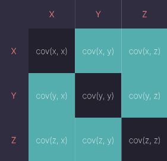

# Алгоритм PCA

## Метод анализа главных компонент (PCA – principal component analysis)

### **Зачем**: 
Иногда мы хотим создать упрощенную модель, максимально точно описывающую реальное положение дел. Часто бывает так, что признаки сильно зависят друг от друга и их одновременное наличие избыточно: зная один, знаем и другой.
Мы можем выразить несколько признаков через один и работать уже с более простой моделью. Избежать потерь информации, скорее всего не удастся, но минимизировать ее нам поможет как раз метод PCA.

Выражаясь более строго, данный метод аппроксимирует n-размерное облако наблюдений до эллипсоида (тоже n-мерного), полуоси которого и будут являться будущими главными компонентами. И при проекции на такие оси (снижении размерности) сохраняется наибольшее количество информации.

### Шаг первый. Стандартизация

Мы осуществляем Стандартизацию исходных переменных, чтобы каждая из них вносила равный вклад в анализ.

Почему так важно выполнить стандартизацию до PCA? 
Метод очень чувствителен к Дисперсиям исходных Признаков. (Если есть больши́е различия между диапазонами исходных переменных, то переменные с бо́льшими диапазонами будут преобладать над остальными (например, переменная, которая находится в диапазоне от 0 до 100, будет преобладать над переменной, которая находится в диапазоне от 0 до 1), что приведет к необъективным результатам.)

### Шаг второй. Матрица ковариации
Цель этого шага – понять, как переменные отличаются от среднего по отношению друг к другу, или, другими словами, увидеть, есть ли между ними какая-либо связь. Порой переменные сильно коррелированы и содержат избыточную информацию, и чтобы идентифицировать эти взаимосвязи, мы вычисляем Ковариационную матрицу.

Ковариационная матрица представляет собой симметричную матрицу размера p × p (где p – количество измерений), где в качестве ячеек пребывают коэффициенты ковариации, связанные со всеми возможными парами исходных переменных. Например, для трехмерного набора данных с 3 переменными x, y и z ковариационная матрица представляет собой следующее:

Поскольку ковариация переменной с самой собой – это ее дисперсия, на главной диагонали (от верхней левой ячейки к нижней правой), у нас фактически есть дисперсии каждой исходной переменной. А поскольку ковариация коммутативна (в ячейке XY значение равно YX), элементы матрицы симметричны относительно главной диагонали.

Что коэффициенты ковариации говорят нам о корреляциях между переменными? На самом деле, имеет значение только знак ковариации. 

Если коэффициент – это:

- положительное число, то переменные прямо пропорциональны
- отрицательное число, то переменные обратно пропорциональны
- 0 - нет линейной зависимости

### Шаг третий. Вычисление собственных векторов
#### Главная компонента 
Это новая переменная, смесь исходных. Эти комбинации выполняются таким образом, что новые переменные (то есть главные компоненты) не коррелированы, и большая часть информации в исходных переменных помещается в первых компонентах. Итак, идея состоит в том, что 10-мерный датасет дает нам 10 главных компонент, но PCA пытается поместить максимум возможной информации в первый, затем максимум оставшейся информации во второй и так далее.

Такая организация информации в главных компонентах позволит нам уменьшить размерность без потери большого количества информации за счет отбрасывания компонент с низкой информативностью.

Здесь важно понимать, что главные компоненты менее интерпретируемы и не имеют никакого реального значения, поскольку они построены как линейные комбинации исходных переменных.

Первый главный компонент - это линия, которая максимизирует дисперсию (среднее квадратов расстояний от проецируемых точек до начала координат).

Второй главный компонент рассчитывается таким же образом, при условии, что он не коррелирован (т.е. перпендикулярен) первому главному компоненту и учитывает следующую по величине дисперсию. Это продолжается до тех пор, пока не будет вычислено p главных компонент, равное исходному количеству переменных.

#### Причем тут собственные вектора?
За всей магией, описанной выше, стоят собственные векторы и собственные значения, потому что собственные векторы матрицы ковариации на самом деле являются направлениями осей, где наблюдается наибольшая дисперсия (большая часть информации) и которые мы называем главными компонентами. А собственные значения – это просто коэффициенты, прикрепленные к собственным векторам, которые дают величину дисперсии, переносимую в каждом основном компоненте.

Ранжируя собственные векторы в порядке от наибольшего к наименьшему, мы получаем главные компоненты в порядке значимости.

### Шаг четвертый. Вектор признака

Вектор признаков – это просто матрица, в столбцах которой есть собственные векторы компонент, которые мы решили оставить. Это первый шаг к уменьшению размерности, потому что, если мы решим оставить только p собственных векторов (компонент) из n, окончательный набор данных будет иметь только p измерений.

### Шаг пятый. Трансформирование данных по осям главных компонент
На этом последнем этапе цель состоит в переориентации данных с исходных осей на оси, представленные главными компонентами (отсюда и название «Анализ главных компонент»). Это можно сделать, перемножив транспонированный исходный набор данных на транспонированный вектор признаков.