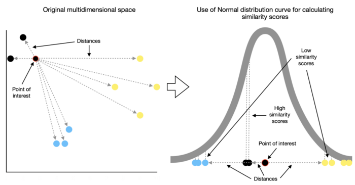
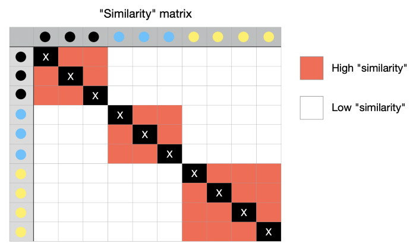
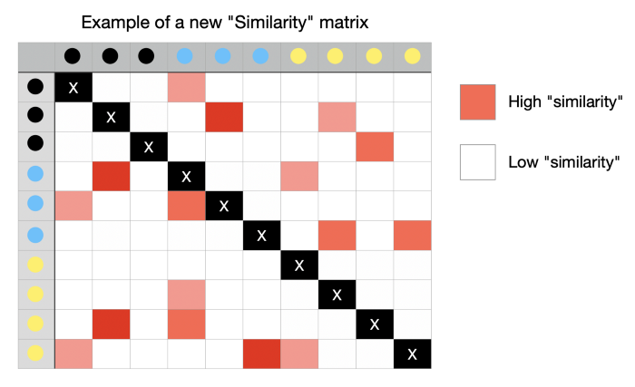

# Алгоритм t-SNE

## Короткий ответ

Алгоритм t-SNE состоит из двух главных шагов. Сначала t-SNE создаёт распределение вероятностей по парам объектов высокой размерности таким образом, что похожие объекты будут выбраны с большой вероятностью, в то время как вероятность выбора непохожих точек будет мала. Затем t-SNE определяет похожее распределение вероятностей по точкам в пространстве малой размерности и минимизирует дивергенцию Кульбака — Лейблера между двумя распределениями с учётом положения точек. Заметим, что исходный алгоритм использует евклидово расстояние между объектами как базу измерения похожести, это может быть изменено сообразно обстоятельствам.

## Подробное описание

### Типы методов уменьшения размерности

Mетоды уменьшения размерности можно дополнительно разделить на два типа:

- **Параметрический** — создающий явную функцию отображения, которую можно использовать для тестовых данных, т.е. для определения местоположения новых точек во вложении с более низкой размерностью (например, PCA);
- **Непараметрический** — не создающий явной функции отображения, т.е. не способный точно отобразить новые точки во вложении с более низкой размерностью.

### t-SNE

**t-SNE** - t-distributed stochastic neighbor embedding (стохастическое вложение соседей с t-распределением).

- Метод уменьшения размерности, относится к непараметрической группе методов.
- Нелинейный
- В основном он используется в целях визуализации.

### Шаг первый. Определения сходства точек

t-SNE начинается с определения сходства точек на основе расстояний между ними. Близлежащие точки считаются похожими, в то время как удаленные считаются непохожими.

Для этого измеряются расстояния между интересующей точкой и другими точками, после чего они помещаются на нормальную кривую. Такие измерения проделываются для каждой точки с применением некоторого масштабирования для учета различий в плотности различных секций.

Результатом этих вычислений является матрица, содержащая оценки сходства между каждой парой точек из исходного многомерного пространства.

### Шаг второй. Используем t-распределение

Далее переходим к t-SNE, который рандомно отображает все точки в более низкоразмерном пространстве и вычисляет сходство между ними, как описано выше. Правда, с одним отличием: на этот раз алгоритм использует t-распределение вместо нормального распределения.

Новая матрица сходства значительно отличается от исходной из-за рандомного отображения. Вот пример того, как это может выглядеть.

### Шаг третий. Минимизация расхождения (расстояния/дивергенции) Кульбака–Лейблера

Теперь цель алгоритма состоит в том, чтобы создать новую матрицу сходства, похожую на исходную, используя итерационный подход (градиентный спуск). С каждой итерацией точки перемещаются к своим ближайшим соседям из исходного многомерного пространства и удаляются от отдаленных.

Новая матрица сходства постепенно начинает больше походить на исходную. Процесс продолжается до тех пор, пока не будет достигнуто максимальное количество итераций или предельное улучшение (критерии останова).

Описание этого процесса в сугубо научных терминах: алгоритм минимизирует расхождение Кульбака–Лейблера посредством градиентного спуска.

### Перплексия

**Перплексия** — гиперпараметр алгоритма, описывает ожидаемую плотность вокруг каждой точки или, другими словами, устанавливает соотношение целевого количества ближайших соседей к интересующей точке.

Низкое значение заставляет алгоритм фокусироваться на меньшем количестве соседей, что приводит ко множеству небольших групп. Напротив, высокое значение перплексии расширяет горизонт соседства, что приводит к уменьшению числа более плотно упакованных групп.
